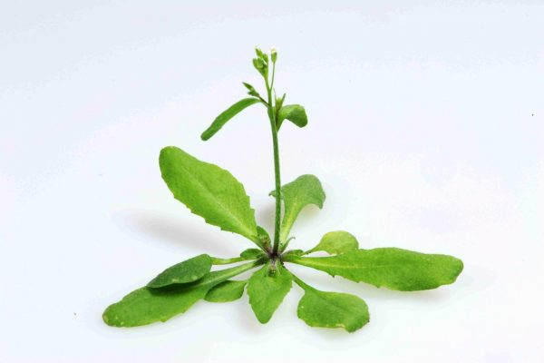

Lab Exercises
=============

Overview
--------
In this lab, we will get familiar with our new Virtual Machine (VM) terminal. If you’ve got unix and command line experience, great! If you don’t, or it’s been a while, don’t stress. Think of this VM like a personal sandbox. It’s yours, it never goes away, and you can’t break anything (too badly).

We will do four major things in this lab:

- Get familiar with your new VM
- Learn some basic unix commands: ls, cd, mkdir, pwd
- Download a genome from TAIR
- Explore that genome with grep

Give it a go, be patient, and ask questions.

    `"Roads were made for journeys, not destinations"` - Confucius

Task A: Get comfortable on the command line
-------------------------------------------

Step 1. Where am I?
^^^^^^^^^^^^^^^^^^^

Help! I’m lost! Where am I? The UNIX command ``pwd`` is your lighthouse.

.. code-block:: bash

    pwd

If this tree-like directory structure doesn’t make sense, stop and review
Module 1 of `LinuxSurvival <https://linuxsurvival.com/linux-tutorial-introduction/>`_

Use ``ls`` to list the files in your current directory:

.. code-block:: bash

    ls

Add a “flag” to ``ls`` to see more information about every file. ``-l`` stands for “long format”.

.. code-block:: bash

    ls -l

What are all the flags you can use for a given command? Read the manual for every UNIX
command by using the man command:

.. code-block:: bash

    man ls

Step 2. Make a new directory for this lab
^^^^^^^^^^^^^^^^^^^^^^^^^^^^^^^^^^^^^^^^^

We use ``mkdir`` to make a new directory (folder). The usage is two parts:

.. code-block:: bash

    mkdir <dirname>

Replace ``<dirname>`` with what you want to call this directory. Make sure it is is one
word, no spaces. I’ll use “Lab1” but organize your life however you’d like to.

.. code-block:: bash

    mkdir Lab1

There’s a nice trick we can use to speed up our command line life, called tab completion.
The tab key is your best friend in UNIX; it is similar to how Google will try and
autocomplete text for you while you’re typing into the search bar. If you start
typing a filename in UNIX, and press the tab key, UNIX will try to complete the
filename or path for you as long as it is unique.

We want to change directories into Lab1 now using the ``cd`` command, but we also want
to be lazy. We *could* type out the full command:

.. code-block:: bash

    cd Lab1

Or, we could just type:

.. code-block:: bash

    cd La

and then press the tab key to complete the word. Try it, and press enter to execute
the ``cd`` command.

Did it work? Use ``pwd`` to see where you are.

This trick works with just about anything you’re typing, like programs,
filenames, scripts, and commands.

Task B: Download the `Arabidopsis thaliana` genome from TAIR
------------------------------------------------------------

Arabidopsis is a powerful model for plant biology. It is not perfect, and is not useful in
every situation. After all, there are >300,000 species of land plants on the planet, so
how could one species possibly be useful to understanding another?

    Image source: Plantlet.org, Credit: Eric Belfield

Step 1. Download the genome for `Arabidopsis thaliana`
^^^^^^^^^^^^^^^^^^^^^^^^^^^^^^^^^^^^^^^^^^^^^^^^^^^^^^

The unix command ``wget`` allows us to fetch data from servers. Not every UNIX command
means something, but wget’s name is derived from World Wide Web + get = wget. Here’s
how we use it:

.. code-block:: bash

    wget https://www.arabidopsis.org/download_files/Genes/TAIR10_genome_release/TAIR10_chromosome_files/TAIR10_chr_all.fas

That’s it, just two parts: wget [path-to-what-we-want-to-fetch]

Step 2. Let’s see what the genome looks like
^^^^^^^^^^^^^^^^^^^^^^^^^^^^^^^^^^^^^^^^^^^^

Use the command ``less`` to open up the FASTA file:

.. code-block:: bash

    less TAIR10_chr_all.fas

This is what FASTA format looks like. FASTA format contains two major parts:

1. A header that starts with “>” and includes information about
2. The sequence on the next line(s). Sometimes the header can have information
   about the chromosome number (as you see here). Other genomes are not so perfect, and
   might be in hundreds or thousands of pieces.

Just like in Microsoft Word, you can use another UNIX program to find words or characters.
This is really helpful if we just want to look at every line that has a FASTA header with
the “>” character.

.. code-block:: bash

    grep ">" TAIR10_chr_all.fas

The Arabidopsis genome is incredibly high quality, since people have been improving
it for nearly 20 years. You should see FASTA headers for 5 nuclear chromosomes, one
chloroplast genome, and one mitochondrial genome.

Step 3. View gene annotation sequences in a FASTA file
^^^^^^^^^^^^^^^^^^^^^^^^^^^^^^^^^^^^^^^^^^^^^^^^^^^^^^

Use your new set of UNIX vocabulary to download the peptide sequences for Arabidopsis.
Here’s the link:

.. code-block:: bash

    https://www.arabidopsis.org/download_files/Sequences/Araport11_blastsets/Araport11_genes.202106.pep.fasta.gz

This file ends in “.gz”. This means that it is compressed using a program
called `gzip <https://www.gnu.org/software/gzip/>`_. This is a very common and nifty
compression tool, just like .zip files on Windows and MacOS. To decompress this file,
all we need to do is:

.. code-block:: bash

    gzip -d filename

The ``-d`` flag means “decompress”. What if we want to compress something?

.. code-block:: bash

    gzip filename

Mastering Content
-----------------

**Exercise 1**: Count the number of genes in the Arabidopsis peptide fasta file.

Hint: You know how to use grep now. Is there a flag you can add to ``grep`` that
will count things for you? Use man and/or Google. If you get stuck, rely on your
colleagues, friends, and classmates in the discussion forum — this is real life,
after all.

**Exercise 2**: Plants have canonical repeat motifs at their telomeres, usually
“CCCTAAA” for most monocots and eudicots (side note: monocots in the
Asparagales order often have “CCCTAA” telomere repeats, like humans).

Count the number of times that the string “CCCTAAA” occurs in the genome
fasta file. Is this a robust way to measure of the length of telomeres in Arabidopsis?
