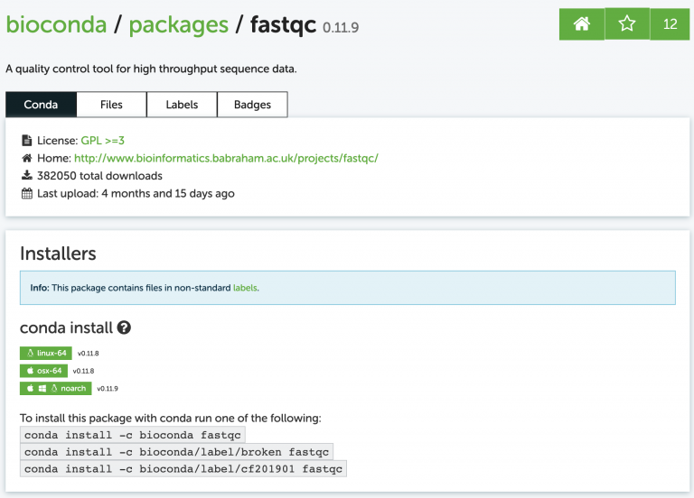
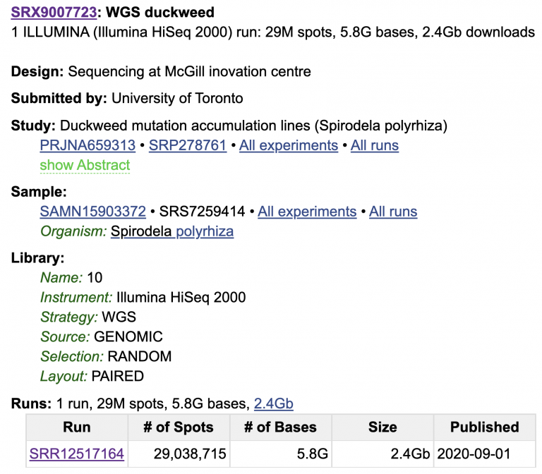
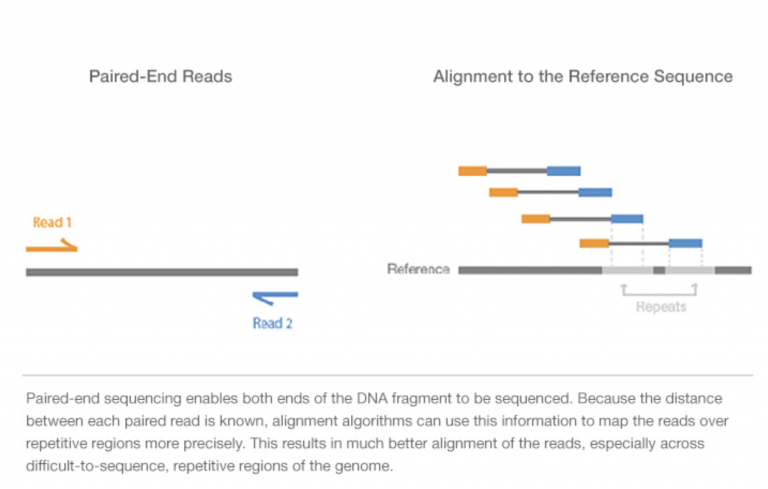
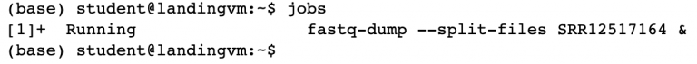

Lab Exercises
=============

Overview
--------

In this lab, we will learn how to Conda, a package manager which makes installing and
running software very simple.

.. image:: ./media/conda_logo.svg
    :alt: Arabidopsis thaliana plant

We will do three major things in this lab:

- Download and install **fastqc** with **conda**
- Download some Illumina data from SRA
- Run **fastqc** on the raw Illumina data

Give it a go, be patient, and ask questions.

    `"I am not discouraged, because every wrong attempt discarded is another step forward."` - Thomas Edison

Task A: Download and run FASTQC
-------------------------------

Step 1. Use Conda to install a package
^^^^^^^^^^^^^^^^^^^^^^^^^^^^^^^^^^^^^^

Conda is amazingly powerful and simple to use. There is an entire collection of
biology-related software that has been deposited into a “channel” of **conda** called
bioconda. Check out all the available software packages you can install at the
`bioconda package repository <https://anaconda.org/bioconda/repo>`_ — more
than 7,000 and growing.

Search for a program called **fastqc**. The website shows us exactly how to install the
program:

I usually just google something like “conda fastqc” and it’s always the first result.
Now install it, just like the website says:

.. code-block:: bash

    conda install -c bioconda fastqc

You’ll probably get a message asking if you want to install some other dependencies
(other programs that fastqc relies on). It will look like this:

    Proceed ([y]/n)?

Whenever you see messages like this in unix, the brackets around [y] mean that if you just
press enter, it will assume you mean “yes”. In other words, [y] is the default assumed
response.

Did it work? Run fastqc with the -h (help) flag and see:

.. code-block:: bash

    fastqc -h

Step 2. Download some Illumina data
^^^^^^^^^^^^^^^^^^^^^^^^^^^^^^^^^^^

How do we store sequencing data? `NCBI’s Sequence Read Archive (SRA) <https://www.ncbi.nlm.nih.gov/sra/>`_ is the dominant
repository for sequencing data. It is free to use in every sense: free to upload data,
free to download data, free to explore. Let’s start at the main SRA page. I got here
just by Googling “NCBI SRA”.

Search for data from one of my favorite plant species, Spirodela polyrhiza, otherwise
known as a duckweed. Find one of the entries that says “WGS duckweed”. WGS means
“Whole Genome Shotgun”, as in randomly sequenced DNA from the genome.
I picked this one: ``https://www.ncbi.nlm.nih.gov/sra/SRX9007723[accn]``

Look through the whole SRA page; there is a lot of metadata attached to this sample.

We know what machine the data was sequenced on (HiSeq 2000), that this is WGS Whole
Genome Shotgun (as opposed to e.g. amplicon sequencing or RNA-seq), that this comes
from Genomic DNA, and that the data are paired-end (meaning two reads per spot on
the flow cell). Click on the SRR Run for more info and a preview of the data.

For Illumina sequencing, paired-end means that each DNA molecule was sequenced from
both ends, producing two reads per spot/molecule. We will cover this more in the
coming weeks, but here’s a visualization of the DNA fragment (grey), sequence read
1 (orange), and sequence read 2 (blue).

    Image Source: `Illumina Website <https://www.illumina.com/science/technology/next-generation-sequencing/plan-experiments/paired-end-vs-single-read.html>`__

If you want to learn more, watch this short 5 minute video on Illumina
Sequencing-by-Synthesis

.. raw:: html

    <iframe src="https://www.youtube.com/embed/fCd6B5HRaZ8"
            width="560"
            height="315"
            title="YouTube video player"
            frameborder="0"
            allow="accelerometer; autoplay; clipboard-write; encrypted-media; gyroscope; picture-in-picture"
            allowfullscreen></iframe>

The data we really need is the SRR number that specifies the run. Luckily, NCBI has
written some software tools called **sra-tool** that allow us to quickly download data
from SRA once we know this SRR number.

Use **conda** to install **sra-tools** on your own, then make a new directory for this lab.
Name it whatever you want, but stay consistent so that your labs are organized and
your home directory is not super cluttered. If you ca not remember how to make a new
directory, go back to the UNIX cheat sheet in the :doc:`Lesson 1 Resources <../Lesson_01/resources>`.

Usually we would download the entire dataset. For this lab, we’ll just download 20
million read pairs from this dataset to save time. Check out the options for **fastq-dump**
using the ``-h`` flag. This admittedly is not the best documented software, and some of the
options are pretty confusing. For data that is paired-end, we need to add the ``–split-files``
flag.

To download this paired-end Illumina data, copy/paste the SRR number into the **fastq-dump**
command:

.. code-block:: bash

    fastq-dump -X 20000000 --split-files SRR12517164

Great! Well, mostly. We’re twiddling our thumbs now since this program is running and we
can’t use the command line. Let’s shove this job into “the background” so we can use our
command line again. Press “Control + Z” to pause the job, and then push the job into the
background using bg.

.. code-block:: bash

    bg

Now we’ve got our command line back. We can see what jobs are running in the background
using jobs:

.. code-block:: bash

    jobs

See how it displays the **fastq-dump** command you entered? This job is now running “in the
background”. The ampersand at the end (&) is a nifty thing. We could have saved ourselves
some time by running the **fastq-dump** command with an ampersand & at the end, which would
automatically start the job in the background.

Data transfer from SRA is not blazing fast, though. Check on the progress of your data
transfer using:

.. code-block:: bash

    ls -lhrt

You can mix and match multiple flags onto UNIX commands. Let’s break this one down:

**ls** = list all the files in my current directory

- ``-l`` = long format (show permissions, date last touched)
- ``-h`` = human readable file sizes. I like this option because it shows me 2G
  instead of 2000000 for the file size. K=kilo, M=mega, G=giga, T=tera.
- ``-t`` = sort the files by the time of their last modification
- ``-r`` = reverse the order, putting the “newest” files at the bottom. These last two
  options, -rt, make it really quick to see how much of your file has been downloaded. It’s especially nice when you have a lot of files in one directory.

Step 3: Look at our fastq files
^^^^^^^^^^^^^^^^^^^^^^^^^^^^^^^

We have two files that end in ``.fastq`` in our directory. They differ in a small but
important way: ``_1.fastq`` and ``_2.fastq``. These two files belong to the same sequencing
run, and represent read1 (``_1.fastq``) and the read2 (``_2.fastq``) for every single sequenced
molecule. We’ll talk more about fastq format soon, but go ahead and look at the files. You
can quickly look at the first few lines of a file using head.

.. code-block:: bash

    head SRR12517164_1.fastq

`Illumina describes the fastq file <https://support.illumina.com/bulletins/2016/04/fastq-files-explained.html>`_ as:

For each cluster that passes filter, a single sequence is written to the corresponding
sample’s R1 FASTQ file, and, for a paired-end run, a single sequence is also written
to the sample’s R2 FASTQ file. Each entry in a FASTQ files consists of 4 lines:

1. A sequence identifier with information about the sequencing run and the cluster. The
   exact contents of this line vary by based on the BCL to FASTQ conversion software used.
2. The sequence (the base calls; A, C, T, G and N).
3. A separator, which is simply a plus (+) sign.
4. The base call `quality scores <https://support.illumina.com/content/illumina-marketing/en/science/technology/next-generation-sequencing/plan-experiments/quality-scores.html>`_.
   These are Phred +33 encoded, using `ASCII <http://drive5.com/usearch/manual/quality_score.html>`_
   characters to represent the numerical quality scores.

Now we’ve got data and we’ve got fastqc installed. Let’s run **fastqc**.

Task B: Run FASTQC and assess the quality of some Illumina shotgun data
-----------------------------------------------------------------------

FASTQC is a simple program that allows us to objectively measure some statistics about a
sequencing run. From the `FASTQC github page <https://github.com/s-andrews/FastQC>`_:

    “FastQC is a program designed to spot potential problems in high througput sequencing
    datasets. It runs a set of analyses on one or more raw sequence files in fastq or
    bam format and produces a report which summarizes the results.”

Step 1: Check out the help options for fastqc
^^^^^^^^^^^^^^^^^^^^^^^^^^^^^^^^^^^^^^^^^^^^^

.. code-block:: bash

    fastqc -h

FastQC looks pretty straightforward to run, right? From the help menu, all we need to run
this program is to list our sequence files.

.. code-block:: bash

    fastqc seqfile1 seqfile2 .. seqfileN

Give it a shot — run **fastqc** on both of your fastq files.

Step 2: Download the results
^^^^^^^^^^^^^^^^^^^^^^^^^^^^

PraxisAI is nifty because it also has a way to download data built-in. I marked two
arrows here on how to download data from this server to your own local computer.

Download both of the ``*fastqc.zip`` files to your own computer (right click, download),
unzip them and open them up. We’ll talk about these together in class.

Mastering Content
-----------------

Step 1: Conda environments
^^^^^^^^^^^^^^^^^^^^^^^^^^

A good tip with **conda** is to keep your default (base) environment clean, and to create new
environments that contain your installed software. You can make as many environments as
you’d like. For example, I have one called “pb-assembly” that contains all software related
to PacBio genome assembly, annotation, and quality control. I have another environment called
“chloroplast” that contains all software I need related to chloroplast genome assembly and
annotation.

Your tasks are to:

1. Create a new conda environment called “toomers”
2. Activate the new environment
3. List all of your current environments
4. Switch your environment back to default (base)
5. Switch your environment back to toomers

Step 2: Messy data
^^^^^^^^^^^^^^^^^^
The duckweed whole genome shotgun data we investigated with **fastqc** looks really clean,
meaning it has high quality scores along the length of both reads, and very little
adapter contamination, among other things. What about something a little messier?

Here is the SRA page for small RNA (sRNA) reads from garden asparagus (Asparagus
officinalis). These are single-end, 50 nt long reads. Small RNAs are typically 18-25
nt pieces of RNA. What happens when the molecule you’re sequencing is shorter than the
read length of the machine?

``https://www.ncbi.nlm.nih.gov/sra/SRX8241476[accn]``

Run **fastqc** on this Asparagus officinalis sRNA data and see for yourself,
then let’s talk about this in class together. Give `this guide <https://hbctraining.github.io/Intro-to-rnaseq-hpc-salmon/lessons/qc_fastqc_assessment.html>`_
on fastqc output a read-through.

.. figure:: ./media/PEcell2.png
    :alt: Adapter trimming only from ends

    Image Source: `Illumina Website <https://support.illumina.com/bulletins/2016/04/adapter-trimming-why-are-adapter-sequences-trimmed-from-only-the–ends-of-reads.html>`__

Step 3: Compression
^^^^^^^^^^^^^^^^^^^

Right now we have lots of ``.fastq`` files sitting around, taking up space. Use the
**gzip** compression algorithm to compress all of them.

.. code-block:: bash

    ls *.fastq
    gzip *.fastq

The asterisk ``*`` is a wildcard. See how it works by using ``ls *.fastq``. It lists every
file that ends in ``.fastq``. Nifty! Unix is all about being lazy (other people call this
“efficiency”).
