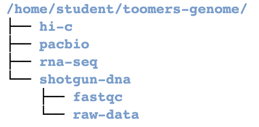

1.3 Lab Exercises
=================

Overview
---------

In this lab, we will learn how to organize our project, then write and run a loop in bash.

We will do four major things in this lab:

- Organize our data and the project
- Make symbolic links to raw data
- Write a bash loop
- Run **fastqc** in a bash loop

Give it a go, be patient, and ask questions.

    `"Some people feel the rain. Others just get wet."` Bob Dylan

Task A: Organize your directories and clean up
----------------------------------------------

Step 1. Project organization
^^^^^^^^^^^^^^^^^^^^^^^^^^^^

First, let’s talk a little about data management and organization. Do you have a lot of files
in your home directory? Is it cluttered? Clean up! Delete things you don’t need anymore
(using the rm command, carefully. Remember: Once it’s gone, it’s gone for good).

Today we’re going to start our first analysis on the Toomer’s Oak data by touching the raw
Illumina data, so let’s go over some best practices in project management. Keep everything
organized! Create a new directory called “toomers-genome” in your home directory, as well
as four directories within, to represent the 4 major data types we’ll be generating.

.. code-block:: bash

    # This quickly gets you to your home directory
    cd ~

    mkdir toomers-genome
    cd toomers-genome

    # We can make multiple directories at once with the mkdir
    mkdir shotgun-dna rna-seq pacbio hi-c

.. note::

    The pound sign / hashtag is the universal symbol for leaving a comment in a piece of code.
    Interpreted languages (like bash, perl, python) ignore any line that starts with #.
    Annotate your scripts, and leave yourself notes, using this symbol! treat your code
    like your lab notebook.

Change directory into ``shotgun-dna``. Then make two more directories called
``raw-data`` and ``fastqc``. Your directory structure should look like this:

I used the **tree** command to make this directory tree.

If you’re struggling to make directories and move around, or if this tree-like
structure of directories doesn’t make sense, be sure to review modules 1 and 2 of
`Linux Survival <https://linuxsurvival.com/linux-tutorial-introduction/>`__.

Step 2: Create symbolic links to the data
^^^^^^^^^^^^^^^^^^^^^^^^^^^^^^^^^^^^^^^^^

We don’t want to mess with the raw data in the shared directory, so we can create a
symbolic link (or softlink) to the data. A soft link is a special kind of file that
points to another file, much like a shortcut in Windows or a Macintosh alias. After
you’ve made the symbolic link, you can perform an operation on or execute "myfile", just as
you could with the source_file. You can use normal file management commands (for example,
``cp``, ``rm``) on the symbolic link.

To create a symbolic link in Unix, we type:

.. code-block:: bash

    ln -s source_file myfile

- ``source_file``: what we want to make a link to
- ``myfile``: the name of the softlinked file you want to make in your current directory. I would suggest keeping this the same as the source_file name.

Our shared class data is held in ``/scratch/`` . We never want to mess with this data
directly — but we can create softlinks to it! There are two .fastq.gz files in there
right now, representing ~100X coverage of an Illumina whole genome shotgun, paired-end
150 nt sequencing library.

.. code-block:: bash

    cd ~/toomers-genome/shotgun-dna/raw-data
    ln -s /scratch/JLGI_PCRfree_1_1_GGTACCTT_Quercus_virginiana_Toomers_I1126_L4_R1.fastq.gz JLGI_PCRfree_1_1_GGTACCTT_Quercus_virginiana_Toomers_I1126_L4_R1.fastq.gz
    ln -s /scratch/JLGI_PCRfree_1_1_GGTACCTT_Quercus_virginiana_Toomers_I1126_L4_R2.fastq.gz JLGI_PCRfree_1_1_GGTACCTT_Quercus_virginiana_Toomers_I1126_L4_R2.fastq.gz

Now we’re organized, and we’ve got softlinks to our raw data.
