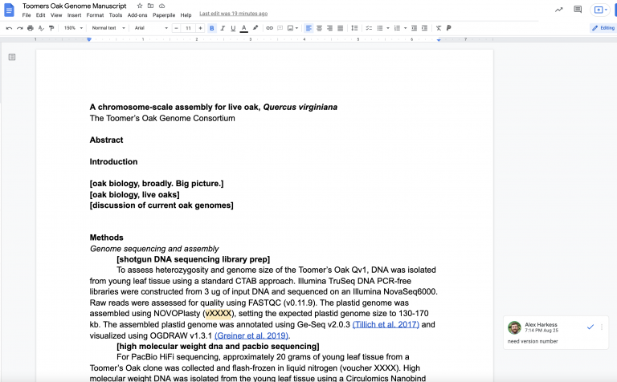
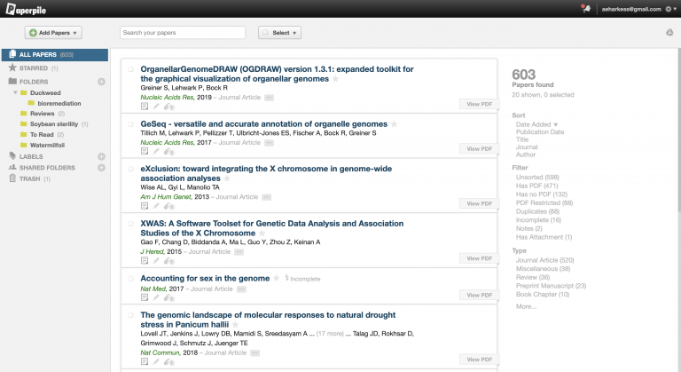
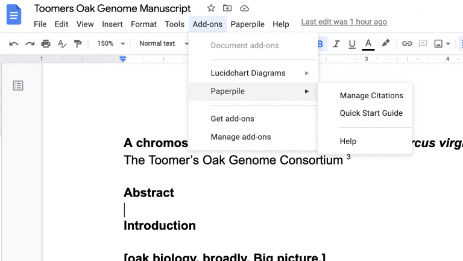

Lab Exercises
=============

Overview
--------

In this lab, we will learn how to write parts of a manuscript as we go along. In cooking,
we say “clean as you cook”, and you will not be left with a giant pile of dishes at the end.
The same thing applies for genomics. Keep your eye on the prize: hypothesizing, experimenting,
performing, and publishing the highest quality science you can, that tells a well-supported
story based on the information you have.

There are also a lot of annoying things that we have to deal with: aggregating citations,
aggregating results from major analyses.

We will do four major things in this lab:

- Learn to work with Google Docs
- Learn how to add citations using Paperpile
- Create the skeleton of our genome manuscript
- Fill in basic stats about our data using MultiQC

    `“If everything was perfect, you would never learn and you would never grow.”` -Beyoncé

Task A
------

Step 1: Get comfortable with Google Docs and Paperpile
^^^^^^^^^^^^^^^^^^^^^^^^^^^^^^^^^^^^^^^^^^^^^^^^^^^^^^

The end goal of our course is to write a manuscript that details the genome assembly and a
variety of analyses for the Toomer’s Oak. Writing a manuscript has changed a lot in the last
decade. Back then, you used to email a Microsoft Word document back and forth between authors.
Thankfully, those days are gone.

There are several ways to collaborate online. Microsoft Teams, Dropbox, Overleaf, and my
personal favorite: Google Docs. A key reason I am fan of Google Docs is its ability for
multiple people to work on the same document at once, the amount of control you as an
author have, and the ability to integrate with third-party plug-ins that make your life
easier.

Check with your instructor for the Google Doc link to the manuscript. Below is an example
screenshot from a previous class.

Poke around the Google Doc. The two main features we’ll use in this class are 1)
making a comment (Insert -> Comment) and 2) making a suggestion (View -> Mode -> Suggesting).
Make sure you know how to do both.

Step 2: Insert a citation with PaperPile
^^^^^^^^^^^^^^^^^^^^^^^^^^^^^^^^^^^^^^^^

My #1 advice with writing a scientific manuscript on Google Docs is, just like with
coding, don’t be a glutton for punishment. There are tools that exist to make your
life easier. **USE THEM**. Managing citations is one of those annoyances. Imagine you have
a manuscript ready to submit, and you’ve painstakingly curated all of the 75 citations
in the text. You used superscripts (e.g. “Plant Genomes can be quite large3“). Your adviser
makes a suggestion and wants you to add an extra citation in the middle of the manuscript.
Do you A) scream, or B) re-do all of the citations by hand?

Just like we Conda as a package manager to help us install software, there are
citation managers we can use to help us insert and edit citations using large
manuscript databases (e.g. PubMed, Google Scholar), and automatically populate
reference lists that meet formatting criteria for different journals. Some common
examples are `Mendeley <https://www.mendeley.com/download-desktop-new/>`__,
`Zotero <https://www.zotero.org/>`__, and
`PaperPile <https://paperpile.com/app>`__. For this course, we’ll use Paperpile –
it integrates with Google Docs, has an Ipad app, and works on every browser.

    My PaperPile database with 603 papers in it. I should read more papers!

If you haven’t already, go ahead and start your `free trial <https://paperpile.com/pricing/>`__
for PaperPile. Download and install the `Google Doc plugin <https://workspace.google.com/marketplace/app/paperpile/894076725911>`__.

Step 3: Insert a citation with PaperPile
^^^^^^^^^^^^^^^^^^^^^^^^^^^^^^^^^^^^^^^^

PaperPile is powerful and useful, but just like every citation manager, it’s not perfect.
Citation managers rely on a community of users to curate and fix incorrect citations,
especially for older or niche manuscripts that aren’t always contained within automatically
populated databases.

Inserting citations in PaperPile is quick and easy. There are two ways to do it. First,
you can open PaperPile as a sidebar in Google Docs by going to the Add-ons tab and
clicking “Manage Citations”.

That opens up a panel to the right side where you can search for manuscripts using the
title, DOI number or just general search terms. Give it a shot — search for a citation
for a paper you recently read, and try to insert it somewhere in the document.

You can also add citations by using the Paperpile menu option. Paperpile >> Insert Citation.

When you’re ready to insert a list of formatted citations at the end of the document, we
use “Format citations”. Whenever we update citations in the text, or add new citations,
we can refresh the final citation list at the end of the manuscript by using “Format
citations”. We can also pick our journal style using “Citation style”.

This is all part of “cleaning as we cook”. As you write, fill in the citation, and
you’ll save yourself tons of time.

Task B: Cleaning up after ourselves
-----------------------------------

Last lab we discovered a few major issues with our data. In particular, a failed
transfer of our fastq files truncated the end.

Step 1: Rerun fastqc on the complete Toomers WGS dataset
^^^^^^^^^^^^^^^^^^^^^^^^^^^^^^^^^^^^^^^^^^^^^^^^^^^^^^^^
Return to the previous lab if you have any trouble. Make sure to leave the results
in ``~/toomers-genome/shotgun-dna/fastqc``

Here are some tricks you can use to shove jobs into the background and keep them
running silently. nohup is a command that means “no hang up”. Output that would
normally go to the terminal goes to a file called nohup. out, if it has not already
been redirected. Add in the ampersand (&) at the end to make sure the job goes into the
background.

.. code-block:: bash

    nohup fastqc -t 4 filename1 filename2 &

Remember how we can run **fastq** multi-threaded?

You can always check on the status of a job in the background by typing **top**.
It is a task manager program, found in many Unix-like operating systems, that displays
information about CPU and memory utilization. Read more about top `here <https://www.unixtutorial.org/commands/top>`__
and how to interpret the CPU and memory usage of your jobs.

.. code-block:: bash

    top

Press “q” to get out.

Mastering Content
-----------------

`MultiQC <https://multiqc.info/>`__ is a software tool that aggregates the results of many
common bioinformatic analyses. As always, our goal is to let computational tools do as much
work as possible for us, especially for the annoying things: for example, how many reads did
we sequence, how many reads are clean, what is the alignment rate of every RNA-seq library
we sequenced, etc etc etc.

From the website: MultiQC is a reporting tool that parses summary statistics from results
and log files generated by other bioinformatics tools. MultiQC doesn’t run other tools for
you – it’s designed to be placed at the end of analysis pipelines or to be run manually
when you’ve finished running your tools.

When you launch MultiQC, it recursively searches through any provided file paths and finds
files that it recognises. It parses relevant information from these and generates a single
stand-alone HTML report file. It also saves a directory of data files with all parsed data
for further downstream use.

Read the manual on how to install and run it on ~/toomers-genome. We will run MultiQC
throughout the semester as we run more programs to update major analyses.

Take note of a particularly important bit here — MultiQC uses python 3.7. MultiQC suggests
that you make a new Conda environment that runs python 3.7. Nifty!

.. code-block:: bash

    conda create --name py3.7 python=3.7 conda activate py3.7
    conda active py3.7
    conda install -c bioconda -c conda-forge multiqc
