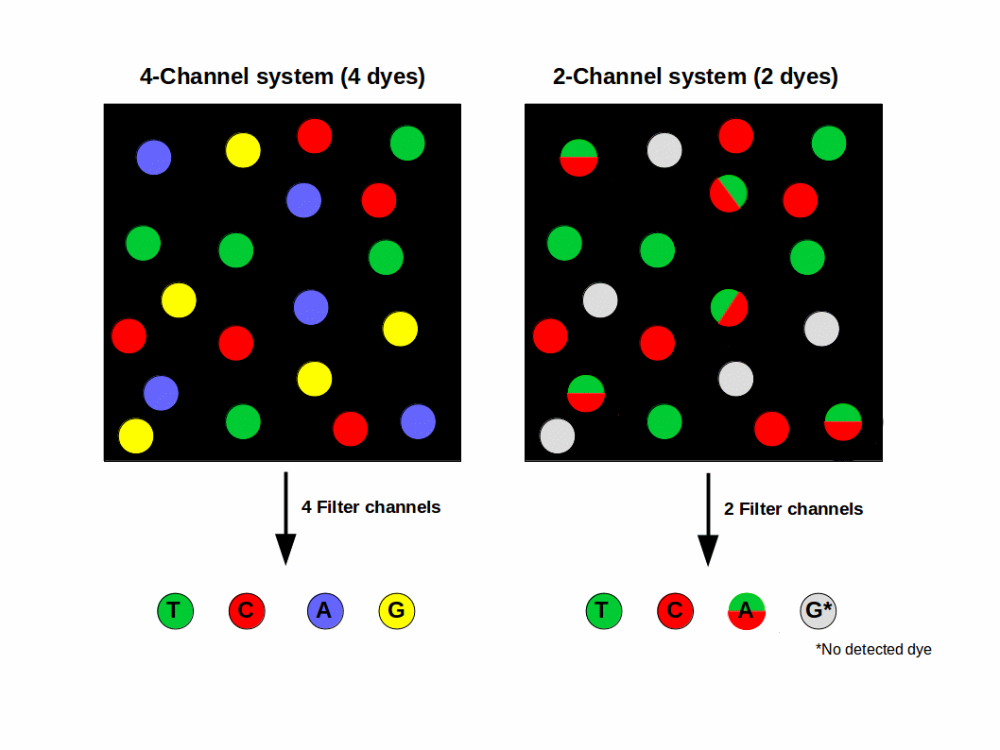
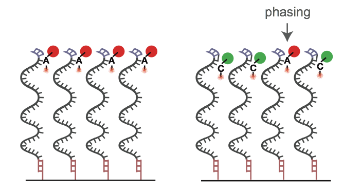
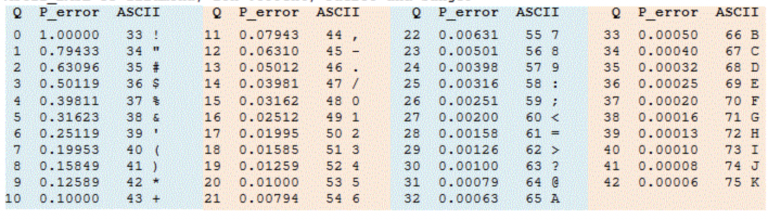
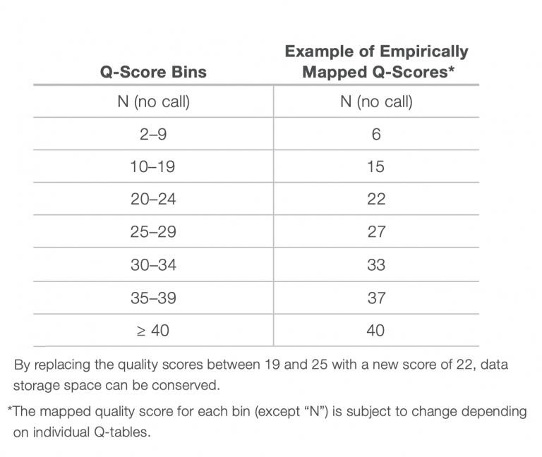
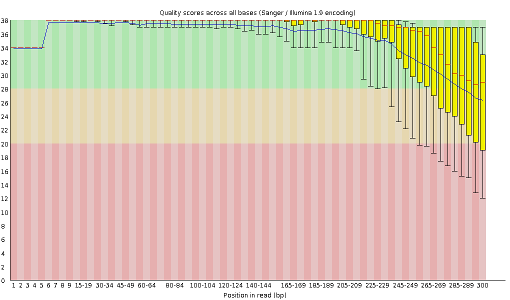

Lab Exercises
=============

Overview
--------

In this lab, we will learn how to clean your raw Illumina data of adapters and poor
quality sequence.

We will do four major things in this lab:

- Learn what Illumina adapter sequences are
- Learn how Illumina quality scores work on the NovaSeq6000
- Run fastp to clean your data
- Calculate sequencing coverage for a sample

    `“If everything was perfect, you would never learn and you would never grow.”` -Beyoncé

Task A
------

Step 1: Learn the structure of an Illumina sequence run
^^^^^^^^^^^^^^^^^^^^^^^^^^^^^^^^^^^^^^^^^^^^^^^^^^^^^^^

Illumina sequencing is based on the chemistry of SBS – “sequencing-by-synthesis”. In the
next lecture you’ll learn more about the intricacies of SBS and how the molecules sit on the
machine’s flow cell. In short, SBS chemistry uses four fluorescently labeled nucleotides to
sequence up to billions of clusters on the flow cell surface in parallel, much like Sanger
Sequencing. During each sequencing cycle, a single labeled deoxynucleoside triphosphate (dNTP)
is added to the nucleic acid chain, one base at a time. A’s are added, then imaged, T’s are
added, then imaged, C’s are added, then imaged, then G’s are added. and imaged. After all 4
bases have been added, all molecules on the flow cell should be advanced by one nucleotide of
length, or 1 sequencing cycle. The dNTPs contain a reversible blocking group that serves as a
terminator for polymerization, so after each dNTP incorporation, the fluorescent dye is imaged
to identify the base and then enzymatically cleaved to allow incorporation of the next
nucleotide. Since all four reversible terminator-bound dNTPs (A, C, T, G) are present as
single, separate molecules, natural competition minimizes incorporation bias, which can
be problematic with serial nucleotide incorporation chemistry used in Sanger sequencing.
Base calls are made directly from signal intensity measurements during each cycle, greatly
reducing raw error rates compared to other technologies.

.. figure:: ./media/sbs-tech-web-graphic.jpg
    :alt: 2-Channel SBS Technology | Faster sequencing and data acquisition

    Image Source: `Illumina Website <https://www.illumina.com/content/dam/illumina-marketing/images/science/v2/web-graphic/sbs-tech-web-graphic.jpg>`__

Check out this short, 5 minute video for a quick primer on Illumina sequencing.

.. raw:: html

    <iframe src="https://www.youtube.com/embed/fCd6B5HRaZ8"
        width="560"
        height="315"
        title="YouTube video player"
        frameborder="0"
        allow="accelerometer; autoplay; clipboard-write; encrypted-media; gyroscope; picture-in-picture"
        allowfullscreen></iframe>

For more than a decade, 4 different dye terminator colors were used (T = green, G = blue,
C = Red, A = yellow), just like Sanger sequencing. This is called 4-color sequencing.
Illumina realized they could speed up sequencing by eliminating two of the colors
altogether, reducing the sequencing time by 50%. This is called two-color sequencing.
There are only two colored fluorophores used now:

If a base lights up green, it’s a T. If a base lights up red, it’s a C. If a base lights
up yellow, it’s A — meaning they mixed red and green fluorphores together for the “A” cycle.
If it’s G, there’s no fluorophore, meaning it’s a dark cycle and no light was emitted. The
axis of the figure below show the intensity of each base, measured in green versus red intensity.

.. figure:: ./media/sbs-redgreen-web-graphic.jpg
    :alt: Simplified Nucleotide Detection

    Image Source `Illumina Website <https://www.illumina.com/content/dam/illumina-marketing/images/science/v2/web-graphic/sbs-redgreen-web-graphic.jpg>`__

    Image Source `EC Seq Bioinformatics Website <https://www.ecseq.com/support/ngs/img/2_and_4_channels_SBS_system.gif>`__

Do you have two colors or four colors in Illumina?

Step 2: Learn how quality scores in Illumina work
^^^^^^^^^^^^^^^^^^^^^^^^^^^^^^^^^^^^^^^^^^^^^^^^^

No sequencing technology is perfect (yet), and errors occur at some frequency. It’s
important to understand the source of these kinds of errors, because 1) they impact the
downstream analyses you want to do, and 2) so you can account for them. Illumina has the
lowest per-base error rate of any modern sequencing platform, which is why it is often
employed for variant calling during resequencing.

The reasons for errors during the base calling process are diverse. In most cases the
emitted light signal of a cluster is disturbed. In this context, it is important to know
that the detected light signal is always a sum of single signals from thousands of molecules
within one cluster. Typical reasons for a polluted cluster light signal can be phasing
(see `quality decrease over illumina reads <https://www.ecseq.com/support/ngs/why-does-the-sequence-quality-decrease-over-the-read-in-illumina.html>`__),
overlapping clusters and not uniform clusters
because of an error in the cluster generation (bridge amplification) step. This can often
lead to a gradual degradation of signal over the course of sequencing a molecule. Because
the probability of errors fluctuates and differs from cluster to cluster and from cycle to
cycle it is necessary and useful to indicate a quality for each called and recorded base
expressed in a score.

    On the left, a perfect sequencing run with many molecules acting the same within a
    single cluster. On the right, an example of “phasing”, where the dNTP blocker
    nucleotide isn’t cleaved, polluting the light signal in the cluster.
    Image Source `EC Seq Bioinformatics Website <https://www.ecseq.com/support/ngs/img/phasing_illumina.png>`__

In the last few years, especially with the introduction of Illumina’s bigger machines like the NovaSeq6000, the data produced by the machine is becoming unwieldy. One source of data bloating was that every single nucleotide of every single read had a quality score attached to it. The quality score (Q score) with the attached probability of error (P_error) was given a different ASCII code:

    Phred33 offset ASCII table.

Illumina’s solution to this issue is to not report the quality score of every single
nucleotide. Instead, quality scores are **binned** into 4 or 8 categories of qualities. See the
table below for an example of how quality scores can be binned into 8 Q-score categories.
In the example below, if a base has a quality score of 7, it gets changed to a “6”. This
saves space because when compression algorithms or formats (like gzip, bzip, .bam) compress
data, repeated stretches of the same byte (like a quality score bin value) can be very
efficiently compressed, resulting in smaller file sizes. In practice, it hasn’t really
mattered much to us; binning actually saves us computational time when we trim the data
and very few people *really* needed to know the Q score of every single base.

Task B
------

Many programs have been written to “clean” Illumina sequencing data. Some common examples
are `trimmomatic <http://www.usadellab.org/cms/?page=trimmomatic>`__,
`TrimGalore! <https://www.bioinformatics.babraham.ac.uk/projects/trim_galore/>`__, and my
personal favorite, `Fastp <https://github.com/OpenGene/fastp>`__. Fastp is exceptionally fast,
and the defaults are excellent. It will automatically trim your fastq dataset with reasonable
defaults, including automatically identifying and trimming the adapter sequences that might
be present in your data.

The structure of an Illumina-ready molecule for sequencing is below. The “insert” is your
biological sequence (e.g. a piece of DNA or RNA), flanked on both sides by “adapter”
sequence that is required for binding to the flow cell. The first read (R1) initiates
sequencing at Primer 1, and reads through the insert sequence on the top strand. Depending
on the length of the insert, and the chosen sequencing read length, sometimes you can
sequencing into the adapter on the other side of the molecule (shown by the red dots).
These adapter sequences at the 3′ ends of reads need to be removed. They are not true
biological sequence!

.. figure:: ./media/read_through_adapter.png
    :alt: Read Through Adapter

    Image Source: `QCFail.com Website <https://sequencing.qcfail.com/wp-content/uploads/sites/2/2016/02/read_through_adapter.png>`__

QC Fail Sequencing » Read-through adapters can appear at the ends of  sequencing reads
These issues are visible in the fastqc plots, like the example below, which shows the
Illumina Universal Adapter being present in a high frequency of molecules starting ~35
nucleotides. The insert must be very short here:

.. figure:: ./media/adapter_content_plot.png
    :alt: Adapter Content Plot

    Image Source: `QCFail.com Website <https://sequencing.qcfail.com/wp-content/uploads/sites/2/2016/02/adapter_content_plot.png>`__

Similarly, remember how chemistry issues like “phasing” can lead to signal degradation
over time? Quality scores often start to drop as the sequencing moves towards the 3′ end
of each molecule. This is normal, and we can detect this in fastqc plots. Below is an
example:

    Image Source `EC Seq Bioinformatics Website <https://www.ecseq.com/support/ngs/img/per_base_sequence_quality.png>`__

- Why does the per base sequence quality decrease over the read in Illumina?
- Does the Toomer’s Oak data display this trend? Let’s look at the fastqc plots you made.

Install fastp
^^^^^^^^^^^^^

Read the github page, and install fastp using Conda. Make sure you’re in your
“toomers” environment (or whatever you decided to name it).

There are many ways to run fastp to output cleaned reads. You can 1) stream the reads
directly to the standard out, so that you can pipe them into another program (e.g. a
read aligner like BWA or bowtie), 2) write the cleaned reads to a separate file (which
takes up space), or 3) output nothing except for the cleaned read statistics. For this
lab, we’ll do #3. In the very near future future, since fastp is so quick to run, we
will use the “streaming” option #1, and make use of pipes. This saves us a lot of
storage — do we need to keep a copy of the raw data, plus a copy of the cleaned data?
Not really*

.. note::

    There are caveats here we will talk about in lab.

Use the same raw Illumina whole genome shotgun data that you used in the last lab. read1
is the file that ends in R1, and read2 is the file that ends in R2. Insert the correct
path to the reads, either the raw data from ``/scratch`` or your softlinked files in your
own directory. The simplest way to run fastp to only generate a quality report of our
data is:

.. code-block:: bash

    fastp -i read1 -I read2
    # yeah, it's that easy.

Use the ampersand (&) to start this job in the background. Ask google or your
classmates if you can’t remember how. This job will take a few hours.

After the run has finished, run MultiQC in the ``~/toomers-genome/`` directory to aggregate
your **fastqc** and **fastp** results.

Mastering Content
-----------------
What depth of coverage did I sequence to?

A question we often ask — “Did I sequence deeply enough?”.

Next-generation shotgun sequencing approaches require sequencing every base in a sample
several times for two reasons:

- You need multiple observations per base to come to a reliable base call.
- Reads are not distributed evenly over an entire genome, simply
  because the reads will sample the genome in a random and
  independent manner. Therefore many bases will be covered
  by fewer reads than the average coverage, while other bases
  will be covered by more reads than average. You need to
  account for this in your planning.

This is expressed by the coverage metric, which is the number of
times a genome has been sequenced (the depth of sequencing). For
applications where you aim to sequence only a defined subset of
an entire genome, like targeted resequencing or RNA sequencing,
coverage means the amount of times you sequence that subset. For
example, for targeted resequencing, coverage means the number of times the targeted subset of the genome is sequenced. In this case, we want to know the sequencing coverage of the whole genome; in other words, how many times did we sequence each nucleotide of the oak tree, on average?

The general equation for computing coverage is:
- C = LN / G
- C stands for coverage
- G is the haploid genome length
- L is the read length
- N is the number of reads

Assume that the diploid genome size of our Toomers Oak is 1.5 Gigabases. What coverage
of Illumina read depth did we sequence to?
