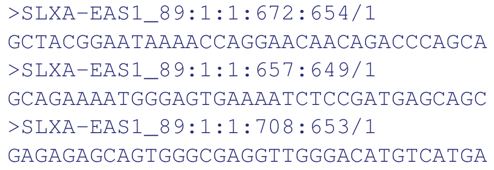
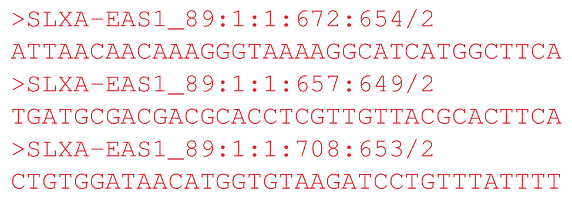
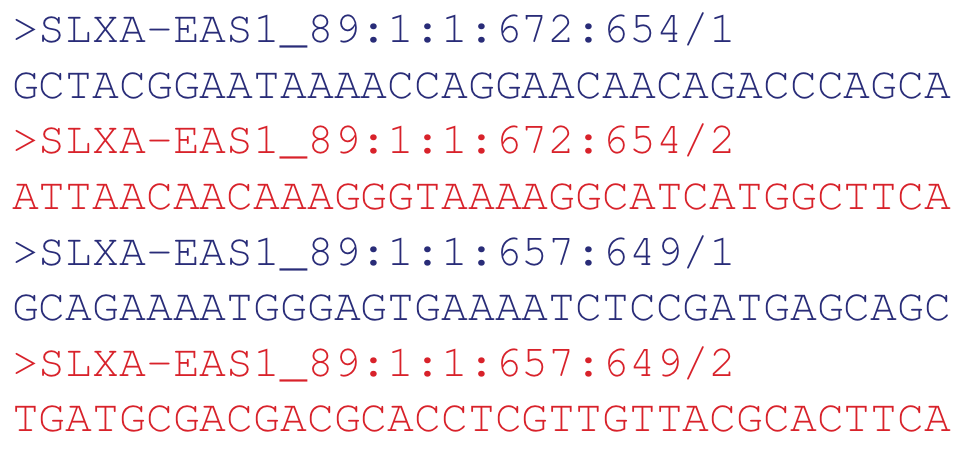
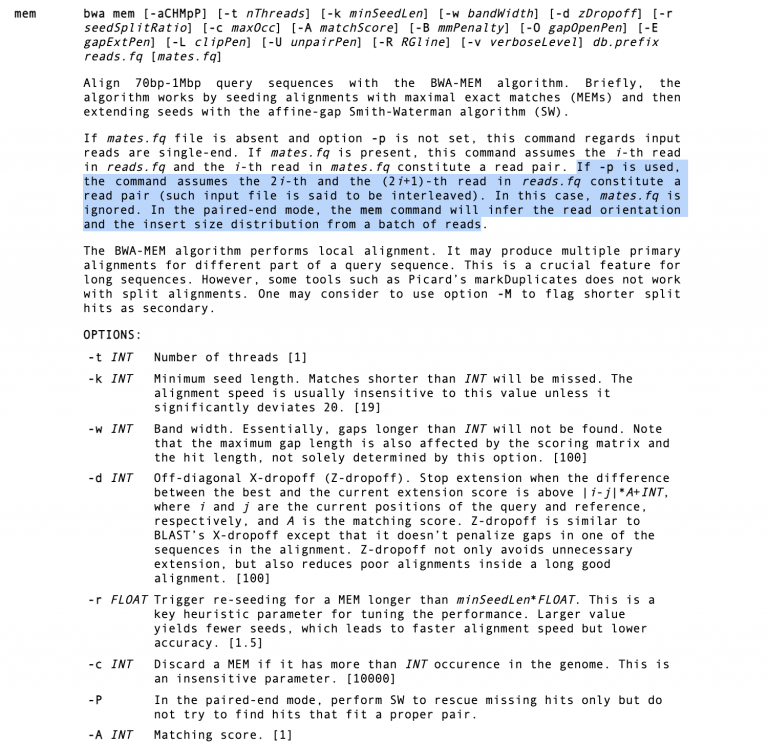
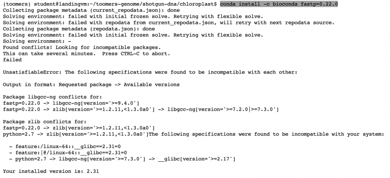
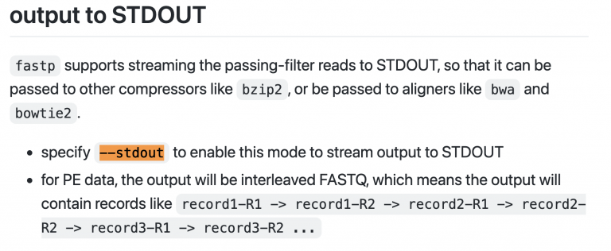

2.2 Lab Exercises
=================

Overview
--------

When you work on a genome project, you’ll be generating several kinds of raw data. In this
lab, we will explore three diverse data types in genomics: fasta, fastq, bam, and gff.
There are many more, but we’ll focus on these for now.

We will do four major things in this lab:

- Dissect the headers of an Illumina fastq file (.fastq format)
- Align short reads to your Toomer’s chloroplast genome (.fasta + .bam)
- Explore the annotation (.gff) and alignments (.bam) in IGV

    `“If everything was perfect, you would never learn and you would never grow.”` -Beyoncé

Task A
------

Step 1: Dissect a fastq file
^^^^^^^^^^^^^^^^^^^^^^^^^^^^

By now, you’ve interacted with fastq files in the class in different ways. Today
let’s really dive into what a fastq file tell us.

A FASTQ file normally uses four lines per sequence.

- Line 1 begins with a ‘@’ character and is followed by a sequence identifier and an
  optional description (like a FASTA title line).
- Line 2 is the raw sequence letters.
- Line 3 begins with a ‘+’ character and is optionally followed by the same sequence
  identifier (and any description) again.
- Line 4 encodes the quality values for the sequence in Line 2, and must contain the same
  number of symbols as letters in the sequence.

Here’s a random read I chose from our fastq file:

::

    @A00406:205:HGTFWDSX2:4:1101:14470:1157 1:N:0:GGTACCTT+GACGTCTT
    ATTTAATACTTCGTTCAGTTAGATCTTAGTTACTGACTGGCGTTAAATAAGCTAAAATGATATTGTTTTGGTTTTCTTTTTTTAATTTTGAAATTAAAAGAAAATTAAAAAACTGTTATTAAAAAAAAAAAACATTTAGGGGAAGAACCCT
    +
    FFFFFFFFFFFFFFFFFFFFFFFFFFFFFFFFFFFFFFFFFFFFFFFFFF:FFFFFFFF:FFFFFFFFFFFFFFFFFFFFFFFFFFFFFFFFFFFFFFFFFFFFFFFFFFF:FFFFFFFFFFFF:FFFFF:FFFFFF:F,FFF,:F:FFFF

Let’s dissect the fastq entry, starting with the first line (a.k.a. the header):

.. list-table::
    :widths: 20 80
    :header-rows: 0

    * - @A00406
      - The unique instrument ID
    * - 205
      - The run ID
    * - HGTFWDSX2
      - The flowcell ID
    * - 4
      - The flowcell lane (4 lanes / NovaSeq flowcell)
    * - 1101
      - Tile number within the flowcell lane
    * - 14470
      - X-coordinate of the cluster within the tile
    * - 1157
      - Y-coordinate of the cluster within the tile
    * - 1
      - For paired-end reads, is this read 1 or read 2
    * - N
      - Y if the read was filtered by the machine for poor quality, N if the read passed. **see below**
    * - 0
      - You can spike in PhiX to a sequence run as a control sequence. If this value ever
        reads “18”, this means the read is matching to a control. Otherwise, 0.
    * - GGTACCTT+GACGTCTT
      - This is the barcode for this library. In our case, we performed dual indexing,
        where each molecule has a unique i5 and i7 index sequence on both ends. The i5
        and i7 8-nucleotide index sequences are separated with a plus sign. i7 is the 3′
        adapter, and i5 is the 5′ adapter. i7 is read first, then i5.

Illumina sequencers perform an internal quality filtering procedure called **chastity filter**,
and reads that pass this filter are called **PF** for **pass-filter**. According to Illumina, **chastity**
is defined as the ratio of the brightest base intensity divided by the sum of the brightest
and second brightest base intensities. Clusters of reads pass the filter if no more than 1
base call has a chastity value below 0.6 in the first 25 cycles. This filtration process
removes the least reliable clusters from the image analysis results.
(Source: `GATK <https://gatk.broadinstitute.org/hc/en-us/articles/360035890991-PF-reads-Illumina-chastity-filter>`__)

.. note::

    **What to look out for**: When you get new data, always use

    .. code-block:: bash

        zcat <fastq.gz> | head

    and check out the first few lines of the fastq file. Check the header for the correct barcode for a few samples. Sequencing centers aren’t perfect, “stuff” happens, and just smart to spot check your data.

**Discussion question**: What do you notice about the barcodes in the first few entries of our fastq files?

Task B: Align reads to your chloroplast genome
----------------------------------------------

Let’s run a very common bioinformatic task, and learn more about fasta, fastq, and bam
files along the way. We are going to align reads to a reference genome. In this case,
the reads will be the PE150 WGS reads we’ve been working with, and the reference will be
the Toomer’s Oak chloroplast fasta you assembled and annotated. Alignment is sometimes
called “mapping”, e.g. “aligning reads to a genome” is the same as “mapping reads to a
genome”. Here’s a broad overview of what we’ll be doing:

.. figure:: ./media/mapping.png
    :alt: Explanation of mapping

    Image Source: `Galaxy Project Website <https://training.galaxyproject.org/training-material/topics/sequence-analysis/tutorials/mapping/tutorial.html>`__

**Fastp** took our two paired-end read files as input, cleaned them, and it can stream the
output (cleaned reads) to another program. How do we deal with the fact that 2 read files
went into fastp, but only one stream can exit as output? There is a flavor of fastq files
called “interleaved”, where Read1 and Read2 are zippered together, like this:

Read1:

Read2:

Interleaved:

BWA, the short read aligner we will use next, can recognize interleaved files.

Step 1: Install BWA
^^^^^^^^^^^^^^^^^^^

BWA is the Burrow-Wheeler Alignment (BWA) program. This is a powerful and fast aligner
that works with both short read (Illumina) and long-read (PacBio, Nanopore) data.
Check out the `Github page <https://github.com/lh3/bwa>`__.

**First**, Install bwa and samtools using Conda. We’ll use BWA to align reads, then
samtools to filter those reads and produce a .bam file that records all of the read
alignments and their locations on the reference.

**Second**, build a bwa index from your Option_1_toomers-cp.fasta assembly (or whatever
you named it). BWA requires building an index for your reference genome to allow it to
more efficiently search the genome during sequence alignment:

.. code-block:: bash

    bwa index Option_1_toomers-cp.fasta

**Third**, check out all the `options for bwa mem <http://bio-bwa.sourceforge.net/bwa.shtml>`__, the aligner we’ll use.
I’ve highlighted an important bit about interleaved files:

Next, we want to set up a series of pipes to stream our data from fastp >> bwa >> .bam
alignment file. I noticed something funny, though — when I checked our version of
fastp, it says 0.12.4. But the Github version says it’s on 0.22.0 ! We really need
the ``–stdout`` option, since that’s how we’ll stream the cleaned reads into BWA
for alignment. But the older version of fastp doesn’t have that option! I wonder if
there’s some incompatibilities we didn’t know about, since we’re all using a new VM
with perhaps different underlying software than we’re used to…

Here’s how we can install a specific version of something on Conda

.. code-block:: bash

    conda install -c bioconda fastp=0.22.0

Failed! Okay. Let’s problem solve. We *could* try and install updated versions of **libgcc**
and **zlib**, but these are more complex compilers that many programs rely on. Is there
another way to run the latest version of fastp without having to install anything?

Remember the difference between interpreted code and compiled code? Sometimes
developers will provide the **precompiled binaries**. `The fastp developers do! <https://github.com/OpenGene/fastp/#or-download-binary-only-for-linux-systems-httpopengeneorgfastpfastp>`__ We can
download and run precompiled binaries without installing anything. Problem solved.

Before you download the binaries, let’s create a new folder called “bin” inside of
toomers-genome, where we will keep any scripts and programs we accumulate throughout
the course. Follow their instructions and download fastp binaries into your
``toomers-genome/bin/`` directory. Here’s what my entire directory organization
looks like now:

.. image:: ./media/dir_tree.png
    :alt: Directory tree

Step 2: String together a set of pipes
^^^^^^^^^^^^^^^^^^^^^^^^^^^^^^^^^^^^^^

Let’s test fastp and see if it can stream the output to the **stdout** (standard out) so that
we can pipe it into BWA for alignment. `The github page <https://github.com/OpenGene/fastp>`__ told me everything I needed to know.
Here’s how I usually test things like this:

.. code-block:: bash

    ~/toomers-genome/bin/fastp \
      -i /scratch/JLGI_PCRfree_1_1_GGTACCTT_Quercus_virginiana_Toomers_I1126_L4_R1.fastq.gz \
      -I /scratch/JLGI_PCRfree_1_1_GGTACCTT_Quercus_virginiana_Toomers_I1126_L4_R2.fastq.gz \
      --stdout | head

Success.

.. note::

    Notice in the command-line above a ``\`` character is used. This allows us to
    split and run a long command across multiple lines which makes it easier to read.
    You can do this with any command, just be sure there are no spaces after the
    ``\`` character. It must always be followed by a new line.

Okay, now let’s string it all together and pipe the output of fastp (cleaned reads) as the input for bwa (to align reads to the chloroplast), and then output a .bam file.

.. code-block:: bash

    ~/toomers-genome/bin/fastp \
      -i /scratch/JLGI_PCRfree_1_1_GGTACCTT_Quercus_virginiana_Toomers_I1126_L4_R1.fastq.gz \
      -I /scratch/JLGI_PCRfree_1_1_GGTACCTT_Quercus_virginiana_Toomers_I1126_L4_R2.fastq.gz \
      --stdout | bwa mem -t 3 -p Option_1_toomers-cp.fasta - | samtools view -F4 -Sb > chloro_alignment.bam

There are three parts to this command, let’s break them down:

1. First, we called fastp to clean our raw paired-end fastq data. We used the ``–stdout``
   flag to output the cleaned reads to the **STDOUT**, meaning they can be streamed into
   another program.
2. We piped the output into BWA. We specified the ``-p`` option so bwa knew that the fastq
   data was interleaved, then we gave it out indexed chloroplast fasta assembly, and we
   told bwa that the input files were coming from the STDIN through a pipe by using “-” as
   the input file.
3. The output of BWA is an uncompressed `SAM <https://genome.sph.umich.edu/wiki/SAM>`__ file
   with a ``.sam`` extension that contains information about every read
   that bwa processed, whether or not it aligned, and reports the location it maps to in the
   reference genome. Check out the linked guide to learn more about ``.sam`` format, and its
   compressed counterpart, ``.bam``. These ``.sam`` files are BIG since theyre uncompressed. And
   they include information about EVERY read, even the ones that don’t align to the reference.
   Remember, we’re aligning total DNA reads against a chloroplast, so only ~5% of our reads
   will align to the chloroplast reference. We can use some flags of samtools to
   filter out unmapped reads (-F4) and that we are feeding it a SAM file but want to
   output a compressed BAM file (-Sb). We’ll spend a full day on samtools soon, but here’s a
   quick primer.
4. Output the filtered .bam file to a new file called chloro_alignment.bam. Call it whatever
   you want!

Mastering Content
-----------------

String it all together and visualize your ``.bam`` file in IGV

How do I visualize these .bam format read alignments against my reference chloroplast
genome? `IGV is a powerful alignment viewer <https://software.broadinstitute.org/software/igv/download>`__.
Download and install it on your computer. Download your chloroplast fasta assembly, the
``.bam`` alignment file, and the ``.bai`` index file to your computer.

.. code-block:: bash

    # Sort your bam file to make it easier to process by putting the reads in order
    # along each fasta entry. Output a sorted .bam file to "chloro_alignment.sort.bam"
    # using 4 threads (-@ 4).
    samtools sort -o chloro_alignment.sort.bam -@ 4 chloro_alignment.bam

    # Index your bam file so IGV can read it
    samtools index chloro_alignment.sort.bam

    # Get some basic stats on how many reads aligned
    samtools flagstat chloro_alignment.sort.bam

In IGV, load your reference chloroplast. It can be loaded by clicking on `Genomes` >>
`Load Genome from File`.

Then you can drag and drop your ``.bam`` file into the main window and it will load the
alignments. Here’s a `great video from IGV <https://www.youtube.com/watch?v=E_G8z_2gTYM>`__
to get you started:

.. raw:: html

    <iframe width="560" height="315"
        src="https://www.youtube.com/embed/E_G8z_2gTYM"
        title="YouTube video player"
        frameborder="0"
        allow="accelerometer; autoplay; clipboard-write; encrypted-media; gyroscope; picture-in-picture"
        allowfullscreen></iframe>

If you haven’t already, go back to your GE-SEQ annotation of the chloroplast and download
the ``.gff`` file of annotations. Drag and drop that gff into the main window to load your
gene annotations and explore. It will take a while to load because there are so many reads.
I wonder if there’s a way to downsample our .bam file to reduce the number of reads…
(can you find a solution?)

Poke around IGV and we’ll talk about it in class and over group chat throughout the week.
Have fun!

.. figure:: ./media/igv_screenshot.png
    :alt: IGV Screenshot

    IGV Screenshot
