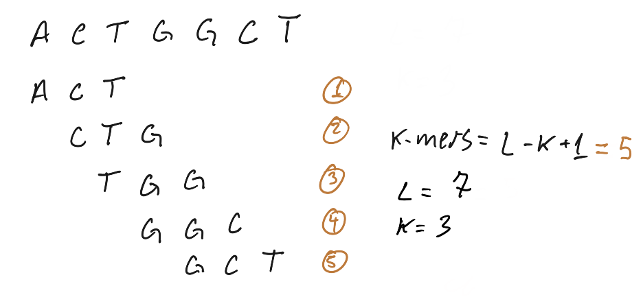
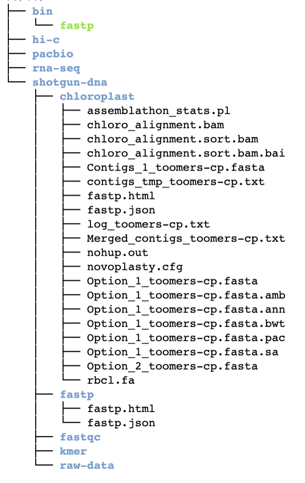
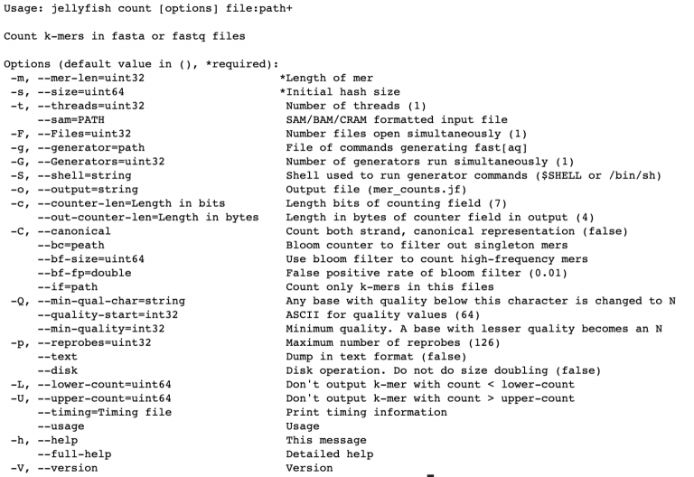
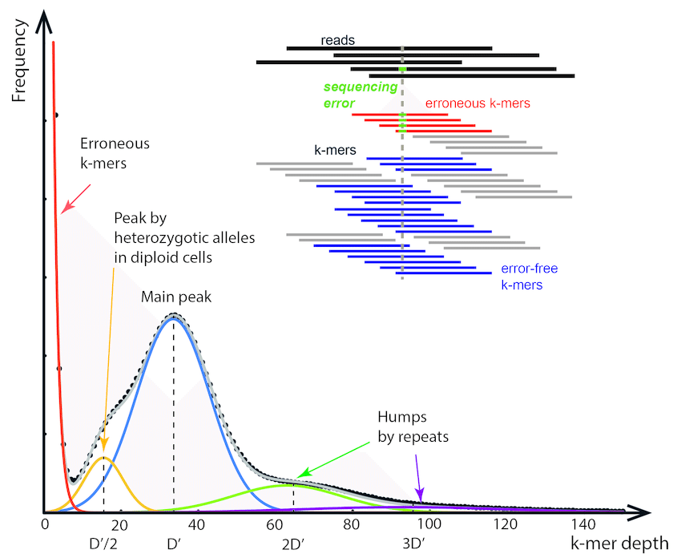
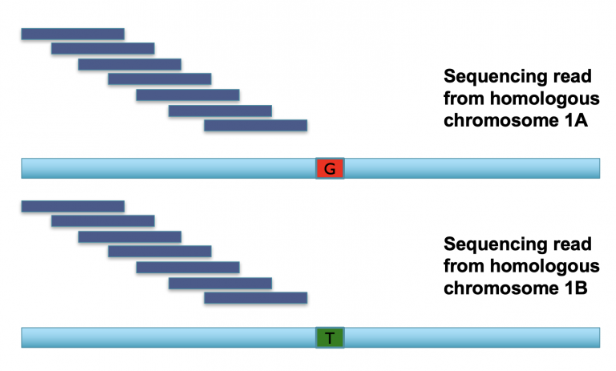
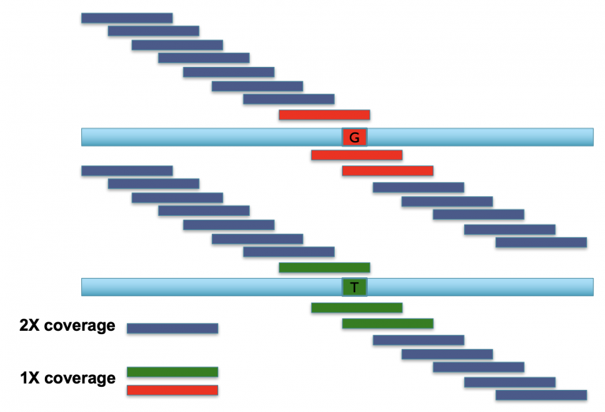
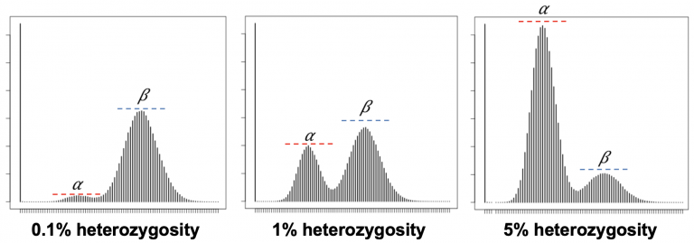
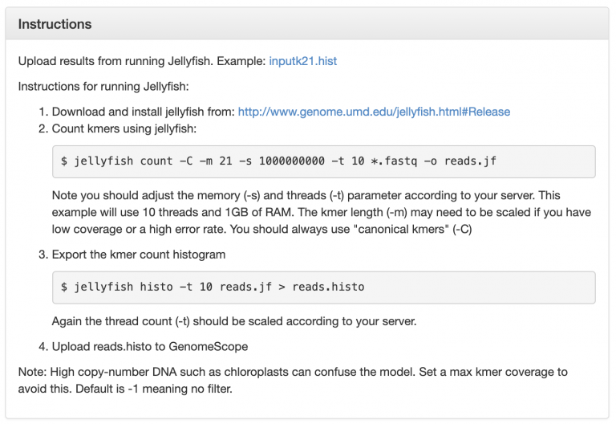
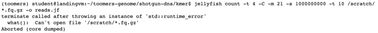

2.3 Lab Exercises
=================

Overview
--------
In this lab, we will learn how to use raw Illumina sequencing reads to genome complexity:
genome size, heterozygosity size, and ploidy.

We will do three major things in this lab:

- Learn what kmers are
- Generate kmer frequencies with Jellyfish
- Run Jellyfish on our dataset

    `“If everything was perfect, you would never learn and you would never grow.”` -Beyoncé

Task A:
-------

Step 1: What is a k-mer?
^^^^^^^^^^^^^^^^^^^^^^^^

Today we’ll explore the power of k-mers and their application to genome sequencing.

K-mers are all possible substrings length k of a sequence string. A sequence string can
refer to an Illumina read, a PacBio read, a gene assembly, a genome assembly, or any other
string of nucleotides. We can search for kmers of any length k.

For a given sequence string length L, there are L – K + 1 possible k-mers in that string.
In the example below, we have a sequence of length (L) = 7: ACTGGCT. To find all possible
k-mers of length 3 (3-mers) in that string:

    Image Source: `K-mer analysis with python <https://voorloopnul.com/blog/kmer-analysis-with-python/diagram1.png>`__

In this example, all possible k-mers were unique and appeared only once. When k-mers appear
more than once, we can count their frequency, e.g. 3-mer “ACT” appears 33 times in the string.

Step 2: Calculate all possible 21-mers in our dataset
^^^^^^^^^^^^^^^^^^^^^^^^^^^^^^^^^^^^^^^^^^^^^^^^^^^^^

First, make a new directory in shotgun-data/ called kmer/. My tree directory looks like this
now:

Next, `install Jellyfish using Conda <https://anaconda.org/bioconda/jellyfish>`__.

I left a reduced dataset of just 10,000 lines of your Toomer’s Oak data in ``/scratch/`` for
us to play around with:

``/scratch/test-kmer.fastq``

Check out the help page for jellyfish count using

.. code-block:: bash

    jellyfish count -help

There are just a couple options we need to invoke, ``-m`` (what kmer size do we want,
``-s`` (how much memory do we want to use to store the kmers), and take note that we
can also multi-thread it with ``-t``. We use ``-C`` to count k-mers on both strands of
DNA (top and bottom).

Here’s how to run jellyfish to count all possible 4-mers in the test data:

.. code-block:: bash

    jellyfish count -C -m 4 -s 10000000 /scratch/test-kmer.fastq > test.jf

The output is a compressed file called “mer_counts.jf” that is not human-readable.
But we can query this file in many ways. For example

.. code-block:: bash

    # Get some stats on the k-mers, including how many occur only once, how many
    # distinct k-mers exist, and how many total k-mers exist.
    jellyfish stats mer_counts.jf

    # dump a fasta-like file with all the kmer's and their counts
    jellyfish dump mer_counts.jf

    # Count the frequency of a specific 4-mer, e.g. ATTG
    jellyfish query mer_counts.jf ATTG

**On your own**: Generate a kmer count of this test dataset for k=7 and count the number
of k-mers ATTCGAG.

Task B
------

Next, we will use Jellyfish and `GenomeScope <http://qb.cshl.edu/genomescope/>`__ to build a
 kmer spectra.

A K-mer spectra is a graphical representation of a dataset showing how many short
fixed length words (k-mers) appear a certain number of times. The frequency of
occurrence is plotted on the x-axis and the number of k-mers on the y-axis.
The k-mer spectra is composed of distributions representing groups of motifs
at different frequencies in the sample, plus biases. Given not too many biases,
the shape of the distributions provides a useful set of properties describing
the biological sample, the sequencing process and the amount of useful data in
the dataset.

    K-mer histogram. The x-axis refers to the k-mer depth D(k), which...
    Image Source: Jang-il Sohn, Jin-Wu Nam, `The present and future of de
    novo whole-genome assembly <https://academic.oup.com/bib/article/19/1/23/2339783>`__, Briefings in Bioinformatics, Volume 19, Issue 1, January 2018, Pages 23–40, https://doi.org/10.1093/bib/bbw096

Sequencing errors occur randomly in Illumina sequencing. These will be represented in a
kmer spectra as a high frequency (high on y-axis) of k-mers that occur just a few times
(low on X-axis).

Let’s review what heterozygosity looks like. In this example we have a diploid
organism with two homologous chromosomes (A and B) for chromosome 1. If we have
two sequencing reads that hit both A and B alleles, and we break up those reads into
k-mers (the dark blue blocks), it looks like this:

The k-mers that span most of these two reads are identical, meaning we have two copies of
every k-mer across most of the read, representing the shared parts of both alleles
(aka the “haploid” representation of the genome). Once we find k-mers that span the
mutation, however, we have k-mers that are unique to each allele (the “diploid”
representation of the genome). Consequently, these diploid k-mers are present at 1/2
coverage relative to the rest of the k-mers in the read.

    Image Source: Mike Schatz

When you do this repeatedly across a diploid genome with shotgun Illumina reads, these
kmer coverages can be used to calculate the heterozygosity of an organism. The
heterozygous k-mers (a) are at 50% depth (the peak on the left) compared to the
homozygous k-mers (the peak on the right). Comparing the relative heights of the
diploid/heterozygous peak on the left, to the homozygous/haploid peak on the right,
allows you to calculate heterozygosity. Increasing heterozygosity means that the left
peak gets higher. X axis is coverage/depth of kmers, and the Y axis is the number of
unique kmers at that given coverage/depth.

These data also tell us genome size, but we’ll discuss that next lab.

Run Jellyfish as GenomeScope describes
^^^^^^^^^^^^^^^^^^^^^^^^^^^^^^^^^^^^^^

`GenomeScope <http://qb.cshl.edu/genomescope/>`__ can calculate heterozygosity for us,
using shotgun sequencing reads. It tells us exactly how it wants to be run:

Now, run Jellyfish count on the raw Toomer’s Illumina data, except remember that we
only have access to 4 threads, so change -t to 4:

.. code-block:: bash

    jellyfish count -t 4 -C -m 21 -s 500000000 /scratch/*.fastq.gz -o reads.jf

Mastering Content
-----------------
If you run Jellyfish like this, you’ll get an error like this one:

Jellyfish can’t open a ``.fastq.gz`` file? Interesting. On your own and with your classmates,
try and troubleshoot this issue.

Hint: I wonder if the `help page <https://github.com/gmarcais/Jellyfish/tree/master/doc>`__ has some clues for us.
