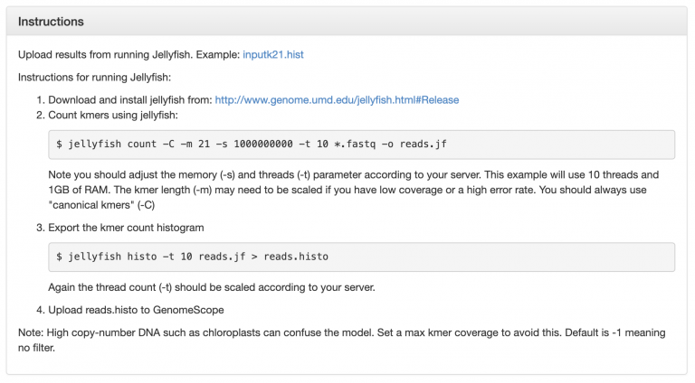
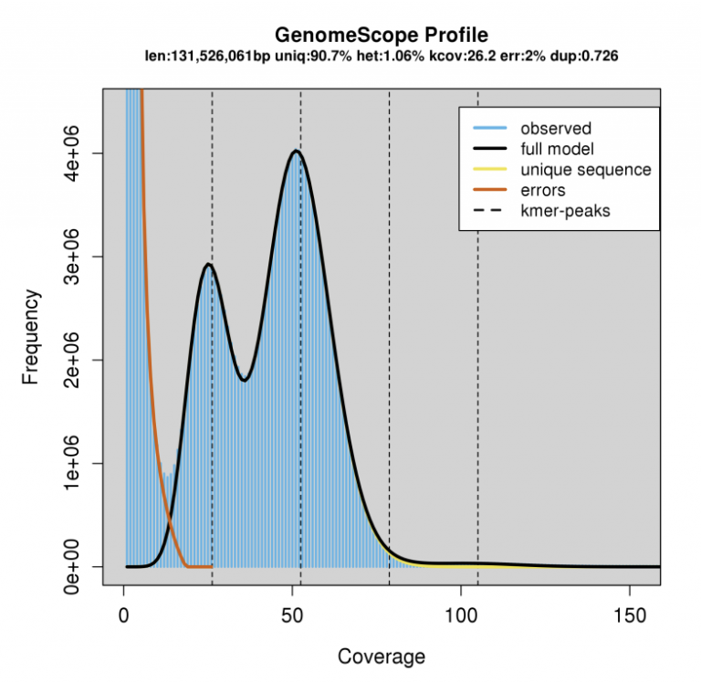
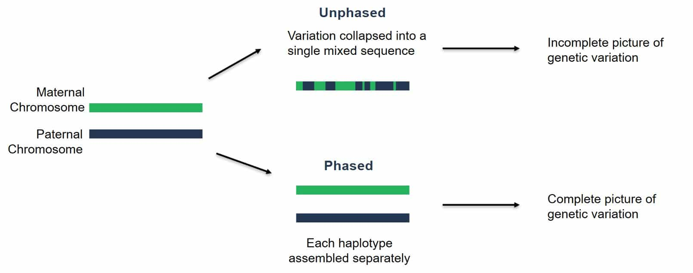
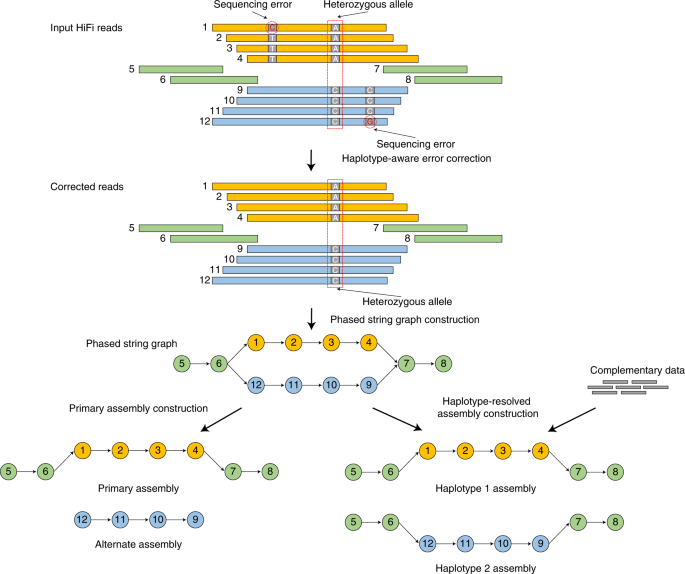

2.4 Lab Exercises
=================

Overview
--------

In this lab, we will learn how to use the Jellyfish kmer counting output to plot
complexity: genome size, heterozygosity size, and ploidy.

We will do three major things in this lab:

- Generate a kmer histogram
- Run GenomeScope
- Interpret the output and make an assessment for the future of our project

    `“If everything was perfect, you would never learn and you would never grow.”` -Beyoncé

Task A
------

Step 1: Finish running Jellyfish
^^^^^^^^^^^^^^^^^^^^^^^^^^^^^^^^

By now, your Jellyfish k-mer counting run should be finished. There’s one more step in order
for us to run GenomeScope – to export the kmer count histogram:

.. code-block:: bash

    # we only have 4 threads, so change -t to 4
    jellyfish histo -t 4 reads.jf > reads.histo

if your jellyfish run hasn't finished, I have left a copy of "reads.jf" in ``/scratch/``

.. note::

    There are some caveats that are important to remember. Extremely large (haploid size >>10GB)
    and/or very repetitive genomes may benefit from larger kmer lengths to increase the
    number of unique k-mers. Accurate inferences requires a minimum amount of coverage,
    at least 25x coverage of the haploid genome or greater, otherwise the model fit will
    be poor or not converge. We have much higher coverage for our Toomer’s Oak genome, so
    we’re all set.

Task B
------
Next, we will use Jellyfish and `GenomeScope <http://qb.cshl.edu/genomescope/>`__ to
build a kmer spectra. Let’s dissect a few of these plots, first.

This is an example GenomeScope plot for a relatively low heterozygosity individual:

.. figure:: ./media/genomescope_low_het.png
    :alt: GenomeScope plot for a relatively low heterozygosity individual

    Image Source: `Bioinformatics Workbook <https://isugenomics.github.io/bioinformatics-workbook/assets/images/genomescope/screen_shot_2017-02-16_at_7.31.20_am.png>`__

The big peak at 25 in the graph above is in fact the homozygous portions of the genome
that account for the identical 21-mers from both strands of the DNA. The dotted line
corresponds to the predicted center of that peak. The small shoulder to the left of
the peak corresponds to the heterozygous portions of the genome that accounts for
different 21-mers from each strand of the DNA. The two dotted lines to the right of
the main peak (at coverage = 25) are the duplicated heterozygous regions and
duplicated homozygous regions and correspond to two smaller peaks. The **shape** of these
peaks are affected by the **sequencing errors** and **PCR duplicates**.

The terms in the plot are defined as:

- **len**: inferred total genome length
- **uniq**: percent of the genome that is unique (not repetitive)
- **het**: overall rate of heterozygosity
- **kcov**: mean kmer coverage for heterozygous bases. note the top of the peak will
  not intersect the kcov line because of the over dispersion in real data
- **err**: error rate of the reads: average rate of read duplications

**Calculating genome size**: A genome size estimate is revised by summing the total n
umber of k-mers, except presumptive sequencing errors identified as the far left part
of the graph, and dividing by the 2*λ, the estimated coverage for homozygous k-mers.
GenomeScope did this math for you, and presents it at **len** at the top.

In other words: subtract out the sequence error kmers, and divide the remaining total
kmers by the haploid peak coverage.

On the other hand, here is an example of a relatively heterozygous individual (1.06%):

**Estimating repeat content in a genome**: Subtract 100-“uniq”. This will be the estimated
% repetitive element content in the genome.

Note the high diploid peak at ~25X coverage, compared to the haploid peak at 50X coverage.
 We can expect ~1% of sites in this genome to be heterozygous. This will create some unique
 differences in the way these two genomes will assemble with PacBio HiFi reads.

As you learned in the sequencing technology lesson, PacBio HiFi reads are highly accurate
(>99%) and long (~20-30kb). In the “low heterozygosity” example, we would likely assemble
an “unphased” assembly, meaning that haplotypes from the maternal and paternal chromosomes
would be smashed together into a chimera.

    Image Source: `PacBio Website <https://www.pacb.com/wp-content/uploads/Phasing-to-seperate-material-and-paternal-haplotypes.jpg>`__

On the other hand, for sufficiently heterozygous individuals, we can fully phase the maternal
and paternal haplotypes of a diploid organism. In other words, we can fully assemble each
chromosome pair separately. This is what the actual assembly graphs look like for
“haplotype-resolved assembly construction”:

    Image Source: Cheng, H., Concepcion, G.T., Feng, X. et al. `Haplotype-resolved de
    novo assembly using phased assembly graphs with hifiasm <https://www.nature.com/articles/s41592-020-01056-5>`__.
    Nat Methods 18, 170–175 (2021). https://doi.org/10.1038/s41592-020-01056-5

**Run Jellyfish as GenomeScope describes**

`GenomeScope <http://qb.cshl.edu/genomescope/>`__ can be easily run by dragging/dropping
your histogram file into the input box, change read length to 150, and click Submit.

.. image:: media/GenomeScope_screenshot3.png
    :alt: GenomeScope Screenshot
    :width: 75%

Mastering Content
-----------------
Based on your new genome size estimation, calculate the estimated coverage of
Illumina PE150 reads that we sequenced. Edit the appropriate section in the manuscript.
Fill in Supplemental Table 1 that includes information about the number of raw read pairs,
and the number of trimmed read pairs after you ran fastp.
