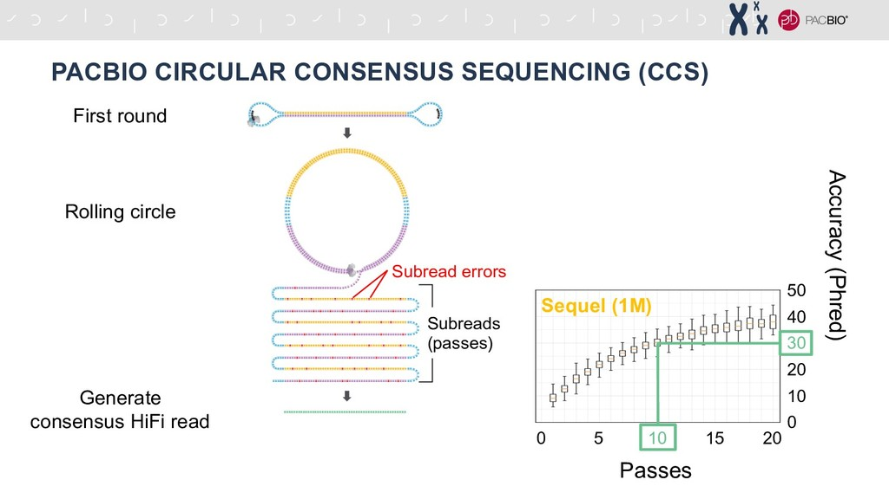
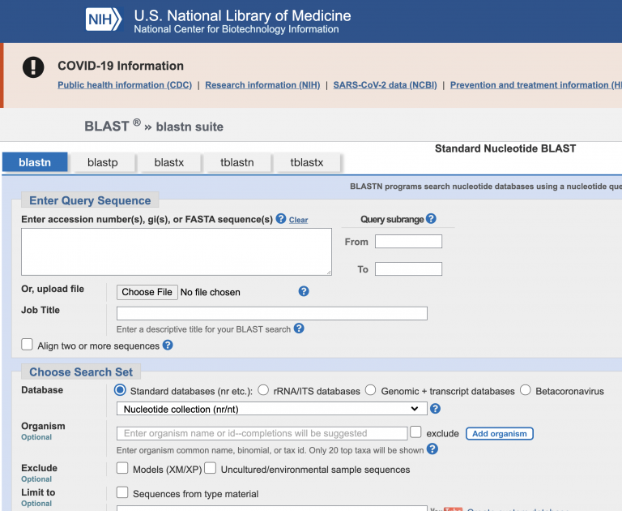
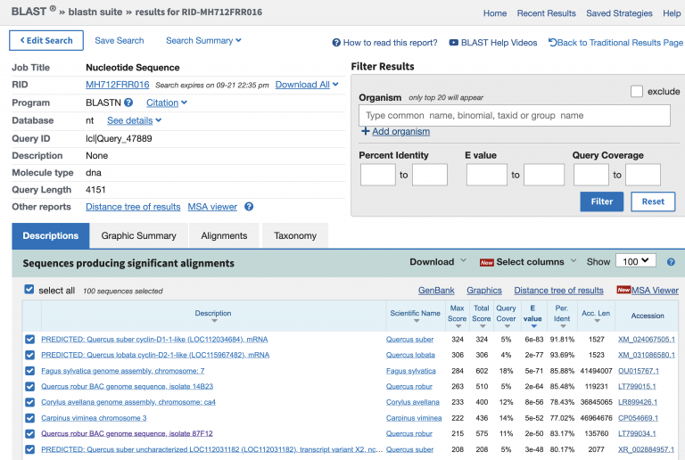

Lab Exercises
=============

Overview
--------
In this lab, we will learn the basics of working with PacBio HiFi (CCS) reads.

We will do three major things in this lab:

- Explore the format of raw PacBio HiFi data
- Sanity check our data using NCBI BLAST

    `“If everything was perfect, you would never learn and you would never grow.”` -Beyoncé

Task A
-------

Step 1: Explore the format and do a sanity check
^^^^^^^^^^^^^^^^^^^^^^^^^^^^^^^^^^^^^^^^^^^^^^^^

Let’s review the basics of PacBio HiFi sequencing, otherwise known as CCS (Circular
Consensus Sequencing). If you need a quick refresher on PacBio HiFi sequencing, here’s a
quick 2 minute clip. The premise of PacBio HiFi is that PacBio sequencing has an inherent
~8% error rate per molecule. However, if you keep rolling the circular template around the
ZMW, you can generate 10-20+ passes (subreads) of that single molecule. The subreads can
then be aligned and used to build a consensus HiFi read that is >99% accurate, depending
on how many subread passes it contains.

    Advantages of HiFi reads for variant discovery and genome assembly -  Speaker Deck

In this class, we generated two PacBio HiFi flow cells worth of data. Each flow cell
produces a ``.fastq.gz`` file. The raw PacBio HiFi data for Toomer’s Oak is in ``/scratch`` with
two files:

- ``m64103_210818_191603.fastq.gz``
- ``m64103_210825_210414.fastq.gz``

First, explore the data a little bit. This is just a regular fastq file — four lines,
except the lines are much longer than an Illumina fastq file. As a reminder, to explore
just the first read:

.. code-block:: bash

    zcat /scratch/m64103_210818_191603.fastq.gz | head -n 4

I like to do sanity checks on my data. Is this really the species I *think* it is?
`BLAST is a simple way to check <https://blast.ncbi.nlm.nih.gov/Blast.cgi?PAGE_TYPE=BlastSearch>`__.
BLAST is an alignment and search algorithm that is widely used: it will become
part of your everyday toolkit. NCBI uses BLAST in a way that allows you to search
against the entirety of the collection; that is, you can search any sequence against
every nucleotide in their database (which is a lot). Copy a chunk of sequence, e.g. 10
lines or more, and copy/paste it into the white box saying “Enter Query Sequence”. Change
the “Program Selection: Optimize For…” to “somewhat similar sequences (blastn)”. Then press
BLAST.

Phew! Most of the top hits are Quercus species or related.

Mastering Content
-----------------
**Your first job**: Use any tool to 1) calculate the total number of bases sequenced, and 2) 
based on your GenomeScope genome size estimate, calculate the PacBio sequencing coverage.
Use google and your classmates. Remember: you have total freedom. Install a useful piece of
software if you find one. This is the essence of computational biology.

Insert your answer as a comment into the Google Doc: How many GB of sequencing data did we
generate, and what X coverage of our estimated genome size did we sequence?

**Bonus**: Can you find a way to plot the read length distribution? Is there a piece of software
that already exists?
