Lab Exercises
=============

Overview
--------
In this lab, we will learn the basics of the hifiasm assembler, and launch an assembly
with our PacBio HiFi data.

We will do two major things in this lab:

- Discuss the basics of haplotype-aware genome assembly
- Launch a hifiasm assembly

    `"Be for real, don't be a stranger"` - Spice Girls

Task A:
-------
Step 1: What is haplotype-aware assembly?
^^^^^^^^^^^^^^^^^^^^^^^^^^^^^^^^^^^^^^^^^

Diploid genomes contain two copies of every chromosome. We call each of these copies a
haplotype. Our new goal for genome assembly is to produce a haplotype-resolved assembly.
Take the example below: two chromosome haplotypes, one from the maternal contribution and
the other from the paternal contribution. Over the last decade, many genome assemblies
have been produced that smash the two haplotypes together, switching between maternal/paternal
haplotypes in a single chromosome representation of the assembly. In other words, these
chromosome assemblies are incomplete.

Nowadays, we have better data that is longer and more accurate. Given sufficient
heterozygosity in a sample, we can phase the chromosome haplotypes. In other words,
we can produce two genome assemblies for every diploid genome.

.. figure:: media/Phasing-to-seperate-material-and-paternal-haplotypes.jpg
    :alt: Phasing to seperate material and paternal Haplotypes

    Image Source: `PacBio Website <https://www.pacb.com/blog/ploidy-haplotypes-and-phasing/>`__

One issue is that without some additional information from the two parents of a diploid
individual, we don’t often know which haplotype comes from the maternal versus paternal
lineage. That is, unless you can also sequence the genomes of the parents! Here’s an example:

.. figure:: media/41587_2018_Article_BFnbt4277_Fig1_HTML.jpg
    :alt: Haptopotype explanation figure

    (a) Two parents constitute four haplotypes, including shared sequences in both
    parents (solid lines) and sequences unique to one parent (dashed lines). The offspring
    inherits a recombined haplotype from each parent (blue, paternal; red, maternal). (b)
    Short-read sequencing of the parents identifies unique length-k subsequences (k-mers),
    which can be used to infer the origin of heterozygous alleles in the offspring's
    diploid genome. (c) Trio binning simplifies assembly by first partitioning long
    reads from the offspring into paternal and maternal sets on the basis of these
    k-mers. Each haplotype is then assembled separately without the interference of
    heterozygous variants. Unassignable reads are homozygous and can be assigned
    to both sets or assembled separately. (d) The resulting assemblies represent
    genome-scale haplotypes and accurately recover both point and structural variation.
    Image Source: Koren, S., Rhie, A., Walenz, B. et al.
    `De novo assembly of haplotype-resolved genomes with trio binning <https://www.nature.com/articles/nbt.4277>`__.
    Nat Biotechnol 36, 1174–1182 (2018). https://doi.org/10.1038/nbt.4277

Okay, let’s review the basics of PacBio hifiasm assembler. Hifiasm leverages both the
long PacBio reads, and k-mers derived from those reads, to identify 1) errors in the
PacBio data, and 2) putative heterozygous allele sites in the data. First, it effectively
recapitulates what you did with GenomeScope: it builds a k-mer distribution from the raw
reads to identify a homozygous and heterozygous peak and their coverages.

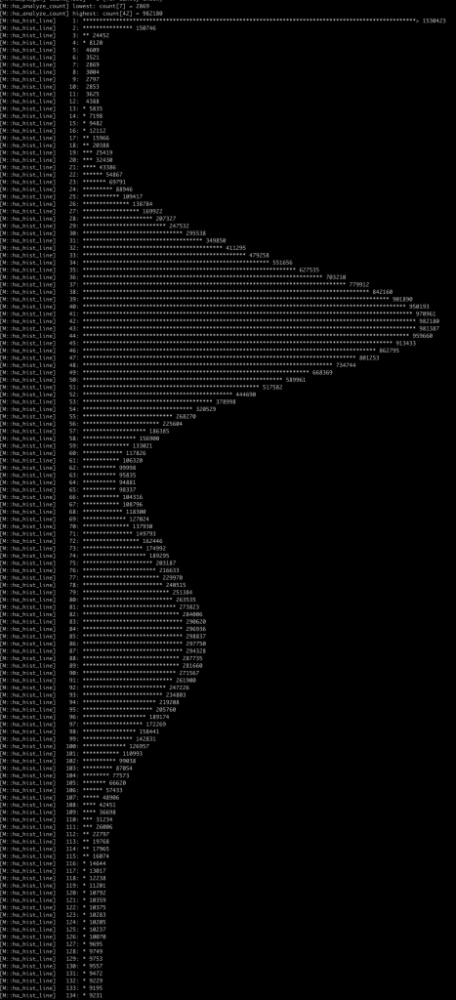

Then, hifiasm builds an OLC graph that finds a path through heterozygous alleles — they
look like bubbles in the graph below. Hifiasm can produce two kinds of assemblies —
primary + alt (left), or a phased haplotype 1 + haplotype 2 assembly. The “primary”
assembly is the best path for one haplotype per contig. The “alt” is the alternative
haplotype.

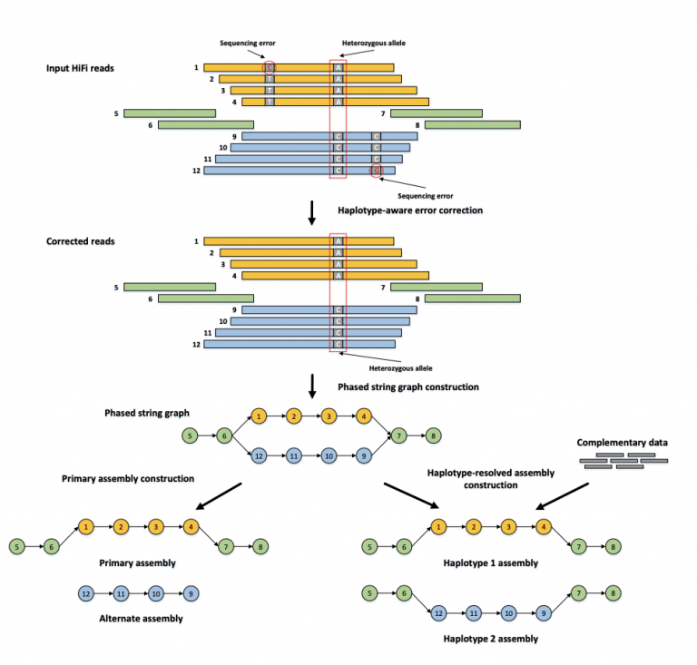

    Orange and blue bars represent the reads with heterozygous alleles carrying local phasing information, while green bars come from the homozygous regions without any heterozygous alleles. In the phased string graph, a vertex corresponds to the HiFi read with the same ID, and an edge between two vertices indicates that their corresponding reads are overlapped with each other. Hifiasm first performs haplotype-aware error correction to correct sequence errors but keep heterozygous alleles, and then builds a phased assembly graph with local phasing information from the corrected reads. Only the reads coming from the same haplotype are connected in the phased assembly graph. With complementary data providing global phasing information, hifiasm generates a completely phased assembly for each haplotype from the graph. Hifiasm also can generate an unphased primary assembly only with HiFi reads. This unphased primary assembly represents phased blocks (regions) that are resolvable with HiFi reads, but does not preserve phasing information between two phased blocks.
    Image Source:  Cheng, H., Concepcion, G.T., Feng, X. et al. Haplotype-resolved de novo assembly using phased assembly graphs with hifiasm. Nat Methods 18, 170–175 (2021). https://doi.org/10.1038/s41592-020-01056-5

In this class, we generated two PacBio HiFi flow cells worth of data. Given our
computational resources on the Virtual Machines (4 threads, 32 GB RAM) we can only
use so much data as input. So I’ve subsetted the data to be smaller, so that it can
still run on our VMs. I subsetted the data to 20 Gigabases (Gb)

    # data in /scratch
    # toomers.20G.subset.fastq.gz

Check out the hifiasm github page. Install the software on your own in your
~/toomers-genome/bin/ directory (or whatever you named it). Here’s the example
for how to assemble heterozygous genomes:

.. code-block:: bash

    # Assemble heterozygous genomes with built-in duplication purging
    hifiasm -o HG002.asm -t32 HG002-file1.fq.gz HG002-file2.fq.gz

Before running hifiasm, read the tutorial first:
https://hifiasm.readthedocs.io/en/latest/pa-assembly.html#pa-assembly

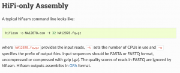

Remember that you only have 4 threads, so adjust ``-t`` accordingly. Launch your job using
the ``toomers.20G.subset.fastq.gz`` HiFi reads.

Mastering Content
-----------------

After your assembly finishes:

1. The assembly file that we’ll focus on is the primary contig assembly. But it’s in a
   .gfa format….Find a solution on google to convert “toomers.subset.gfa.bp.p_ctg.gfa”
   to a .fasta file.
2. Then use the assemblathon_stats.pl script to calculate basic statistics about your
   assembly. What is the total size, what is the `contig N50 <https://www.molecularecologist.com/2017/03/29/whats-n50/>`__?

So I have an Assembly... Now What?
----------------------------------

Step 1: Understand the output
^^^^^^^^^^^^^^^^^^^^^^^^^^^^^

Hifiasm outputs a handful of files:

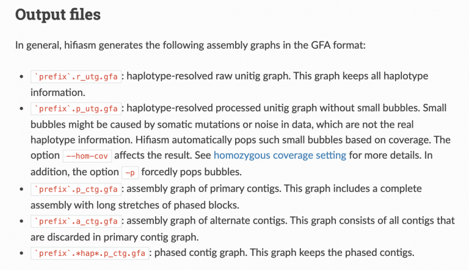

Let’s go over some of this terminology, first. The
`PacBio manual <https://www.researchgate.net/profile/Loubna-Youssar/post/Contig-vs-Unitig/attachment/5c1cd1353843b006754cbf55/AS%3A706241223487493%401545392437445/download/PacBio_Hybrid_Assembly_Practical.pdf>`__
is quite helpful here:

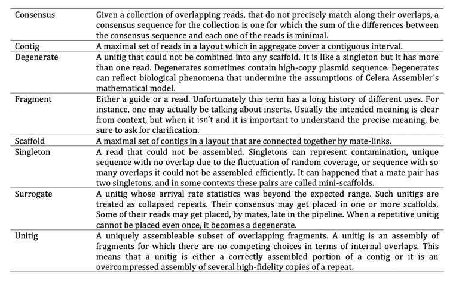

For your assembly, using just the HiFi reads, you produced an assembly like on the left.
Just the primary contigs:

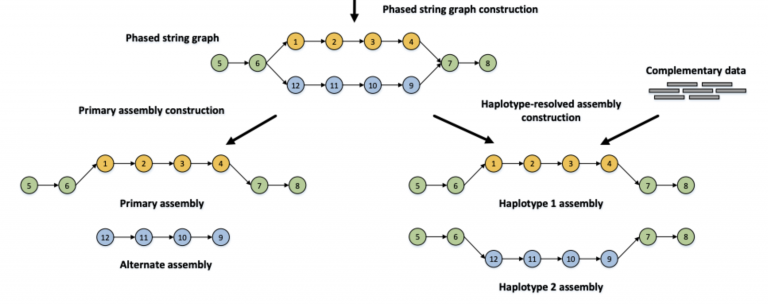

    Image Source:  Cheng, H., Concepcion, G.T., Feng, X. et al. Haplotype-resolved de novo assembly using phased assembly graphs with hifiasm. Nat Methods 18, 170–175 (2021). https://doi.org/10.1038/s41592-020-01056-5

Step 2: Get the basic stats.
^^^^^^^^^^^^^^^^^^^^^^^^^^^^

You should have run assemblathon_stats.pl on your “toomers.subset.gfa.bp.p_ctg.fasta”
assembly. It reports a handful of statistics, both on the contigs and the scaffolds.
We’ll talk about the difference between these two things in class. In short, scaffolds
have gaps (NNNNNNNN) of unknown length that connect contigs together. Contigs are
contiguous, meaning no gaps.

`Molecular Ecologist <https://www.molecularecologist.com/2017/03/29/whats-n50/>`__ describes
N50 in a simple way: Imagine that you line up all the contigs in your assembly in the
order of their sequence lengths (Fig. 1a). You have the longest contig first, then the
second longest, and so on with the shortest ones in the end. Then you start adding up
the lengths of all contigs from the beginning, so you take the longest contig + the
second longest + the third longest and so on — all the way until you’ve reached the number
that is making up 50% of your total assembly length. That length of the contig that you
stopped counting at, this will be your N50 number.

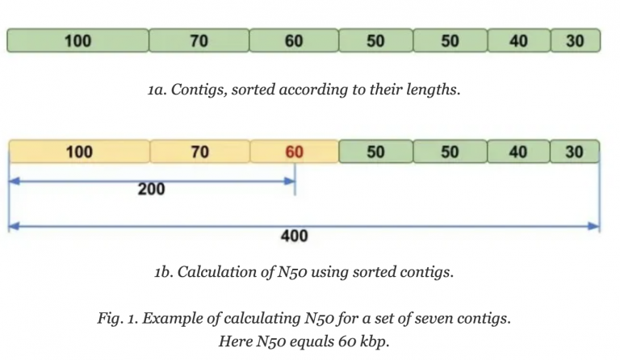

    Image Source: `Molecular Ecologist <https://www.molecularecologist.com/2017/03/29/whats-n50/>`__

Step 2: Figure out the lengths of contigs
^^^^^^^^^^^^^^^^^^^^^^^^^^^^^^^^^^^^^^^^^

Here’s another one of those one-liners that I keep around in my back pocket for things like this. Change “assembly.fasta” to whatever your assembly is called.

.. code-block:: bash

    cat assembly.fasta \
      | awk '$0 ~ ">" {if (NR > 1) {print c;} c=0;printf substr($0,2,100) "\t"; } $0 !~ ">" {c+=length($0);} END { print c; }' \
      | awk '{print $1,$3}' \
      | sort -nk 2

You can copy/paste this into Excel or Google Sheets if that helps. How many haploid
chromosome does Q. virginiana have? How many large contigs do we have? Wow !

Step 3: Check out the assembly produced with ALL of the data, using the Hi-C integrated build
^^^^^^^^^^^^^^^^^^^^^^^^^^^^^^^^^^^^^^^^^^^^^^^^^^^^^^^^^^^^^^^^^^^^^^^^^^^^^^^^^^^^^^^^^^^^^

When you add in Hi-C data to the assembly process, hifiasm is allowed to use an additional
data type to phase the two haplotypes. I’ve run the exact same command as you all, adding
both flow cells worth of data, plus the Hi-C data, and started a hifiasm run. Just like the
assembly on the right side:

    Image Source:  Cheng, H., Concepcion, G.T., Feng, X. et al. Haplotype-resolved de novo assembly using phased assembly graphs with hifiasm. Nat Methods 18, 170–175 (2021). https://doi.org/10.1038/s41592-020-01056-5

The output that matters the most to us, the two phased haplotype fasta files, can be found in
scratch:

``hifiasm.hic.gfa.hic.hap1.p_ctg.fasta``

``hifiasm.hic.gfa.hic.hap2.p_ctg.fasta``

First, we want to see how similar these two assemblies are in terms of length.

Next, how different are they in terms of structural variations? `Assemblytics <http://assemblytics.com/>`__
is a nifty online GUI that can build dotplots that compare two reference
genome assemblies. Download and install MUMMER (https://sourceforge.net/projects/mummer/files/mummer/3.23/).

If you use Conda, make sure you download MUMMER3 and NOT MUMMER4, or else everything
will break.

I keep this dotplot reference handy for how to interpret dotplots that compare a Reference
versus a Query.

.. figure:: media/dotplot.png
    :alt: Dotplot reference

    Image Source: `GalaxyProject Training Material <https://galaxyproject.github.io/training-material/topics/assembly/images/dotplot.png>`__

Assessing haplotypes
--------------------
Step 1: Run Assemblytics
^^^^^^^^^^^^^^^^^^^^^^^^

How similar are our two haplotypes? Which haplotype do we want to move forward with
for scaffolding with Hi-C? Assemblytics is a nifty and quick way to quickly build dot
plots that compare to sequences (or sets of sequences, e.g. in fasta files).

A **dot plot** is a graphical method that allows the comparison of two biological sequences
and identify regions of close similarity between them. It is probably the oldest way of
comparing two sequences [Maizel and Lenk, 1981].

Dot plot are two dimensional graphs, showing a comparison of two sequences. The principle
used to generate the dot plot is: The top X and the left y axes of a rectangular array are used to represent the two sequences to be compared.

**Calculation: Matrix**
- Columns = residues of sequence 1
- Rows = residues of sequence 2.

A dot is plotted at every co-ordinate where there is similarity between the bases.

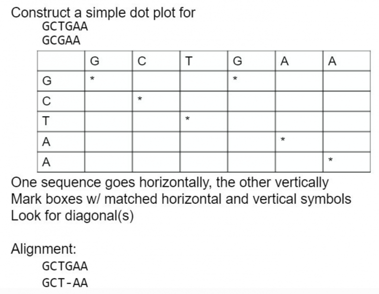

What about an example with longer sequences? Plus repeats!

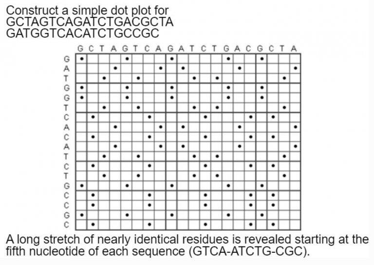

Simple dot plots get too noisy when comparing every single nucleotide in a string. The
solution is to compare windows of strings.

Install MUMMER and run assemblytics, just as the online instructions tell you to.

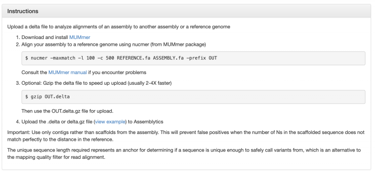

Depending on how you installed it, you might run into some problems.

**Setting the window size of matches**

We use the ``-l 100`` and ``-c 500`` options for Assemblytics, per the online manual. Check
out the nucmer manual for what these options mean:

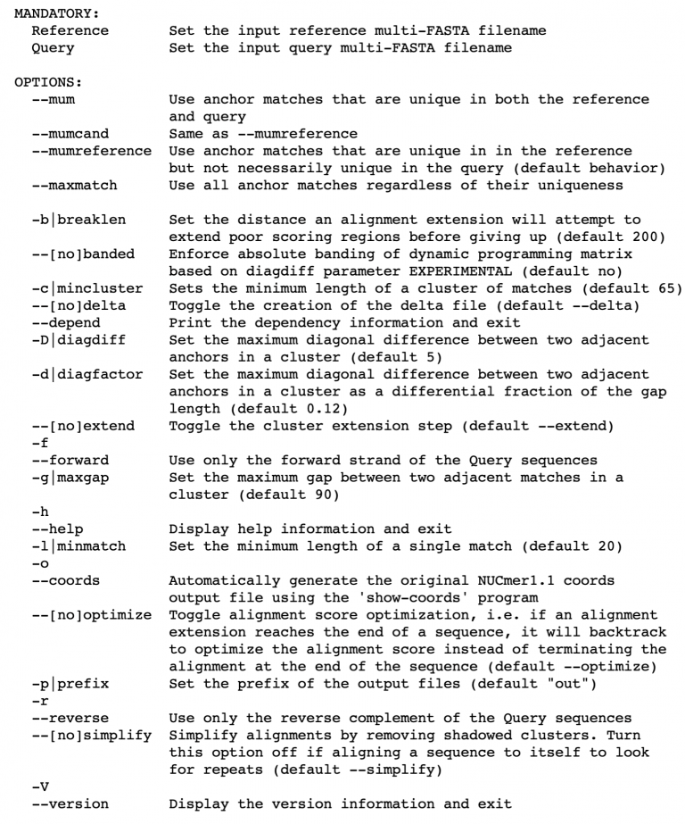

``-l 100`` means that a minimum match between two sequence strings must be at least
100 nucleotides. ``-c 500`` means that we must have several overlapping matches that
equal at least 500 nucleotides. Only alignments matching these two parameters will be
output. This filters out quite a bit of noise, especially in our case, since the two
haplotypes should be *fairly* similar (~1.5% heterozygous).
