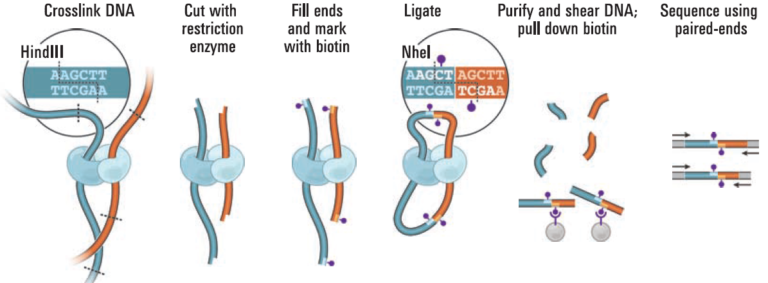
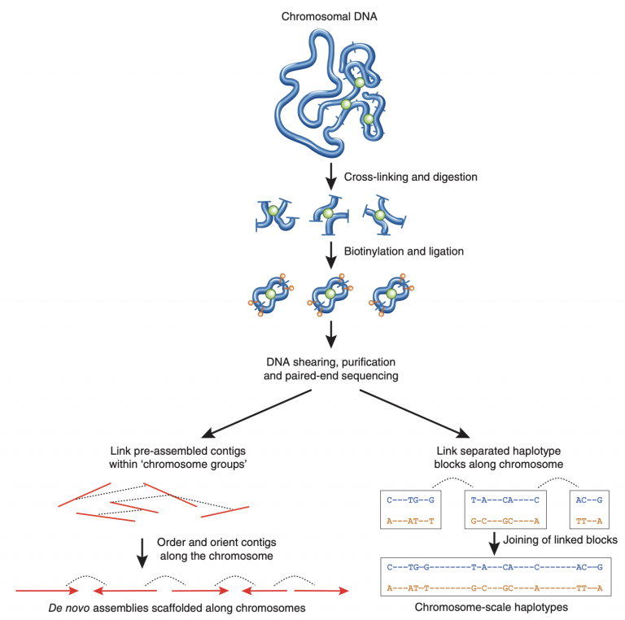
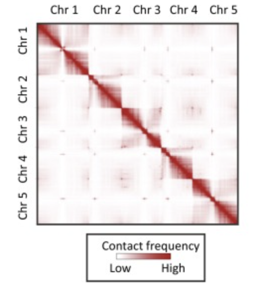

Lab Exercises
=============

Overview
--------

In this lab, we will learn the basics of Hi-C, and how to QC your data, and scaffold a
genome.

We will do two major things in this lab:

- Discuss the basics of Hi-C
- QC your Hi-C data to assess the quality of the long-range links
- Align Hi-C data to your haplotype-resolved assembly
- Explore the contact matrix to resolve assembly issues
- Scaffold your haplotype assembly into chromosome pseudomolecules

    `"Be for real, don't be a stranger"` - Spice Girls

Task A
-------
Step 1: What is Hi-C sequencing?
^^^^^^^^^^^^^^^^^^^^^^^^^^^^^^^^
How do we take assembled contigs and order/orient them into chromosomes? Hi-C is a
powerful technique that captures interactions of chromatin.

DNA is balled up in a cell, packed and positioned in a somewhat predictable way based
on interactions with nucleosomes that wrap DNA. There is order, to a degree.

.. figure:: media/41477_2018_199_Fig1_HTML.png
    :alt: Three-dimensional chromatin packing and positioning of plant genomes |  Nature Plants

    Image Source: Doğan, E.S., Liu, C. Three-dimensional chromatin packing and
    positioning of plant genomes. Nature Plants 4, 521–529 (2018).
    https://doi.org/10.1038/s41477-018-0199-5

DNA is wrapped around **nucleosomes**. Sometimes, DNA can form predictable **loops**, where
distant pieces of DNA interact. Enhancers that increase gene expression from a distance
are sometimes found here. **TADs** (topologically-associated domains) are regions of DNA
that show a higher-than-expected level of chromatin interaction. That is, they form
associations more often than expected compared to the genome average. Different
regions of chromosomes, or different chromosomes altogether, can form different
**compartments** in a nucleus of transcriptionally active (A) and repressed (B) regions.
That is, there is a hidden layer of organization within a nucleus that Hi-C can uncover.

We can cross-link DNA that is in close proximity, creating covalent bonds that “attach”
two DNA strands together. Usually, these two cross-linked regions are very closely
linked on the same chromosome, with little physical distance between them on the linear
length of a chromosome. Sometimes, these two cross-linked strands can be from physically
distant parts of the same chromosome. Typically, individual homologous chromosomes tend
to occupy distinct territories inside a nucleus, meaning that Hi-C can be used to phase
DNA haplotypes in a genome assembly. In other words, since we assembled two fairly
distinct haplotypes in our assembly, we should be able to extend some of those
haplotype blocks using Hi-C.

    Image Source: `Nucleus Biotech Website <https://nucleusbiotech.com/wp-content/uploads/2020/07/Hi-C_Overview.png>`__

We can use these short-range and long-range interactions within homologous chromosomes
to scaffold our genome assembly into full-length chromosomes, and to phase out the
haplotypes.

    Image Source: Korbel, J., Lee, C. Genome assembly and haplotyping with Hi-C.
    Nat Biotechnol 31, 1099–1101 (2013). https://doi.org/10.1038/nbt.2764

(with hifiasm, we did both of these things at the same time using the hi-c integrated
assembly option)

We can count up the number of interactions between DNA regions from the Hi-C sequencing,
and build a giant matrix of all those counts. We expect to find a large number of
interactions between DNA that is close together on the same chromosome, which leads
to an overwhelmingly high signal along the diagonal of a dot plot. But, we also
want these longer-range interactions that allow us to link together contigs that
are distant.

Step 2: QC our Hi-C data
^^^^^^^^^^^^^^^^^^^^^^^^

`Phase Genomics <https://phasegenomics.com/>`__ is a popular company that does
fee-for-service (contract) work on genome assembly and metagenomic analyses.
They provide kits where you can generate your own Hi-C data from your individual
and do all the informatics yourself, or you can send them frozen leaf material and
they will do 100% of the work (library prep, sequencing, and informatics/scaffolding).

First, we want to check to see how good our Hi-C data is. That is, are there
short-range AND long-range interactions occurring, that will help us scaffold
our genome? Phase Genomics provides a helpful QC pipeline and scripts that can
quickly tell us the quality of our data, given only a few million reads, and a
reference genome of something very closely related or a draft genome.

From Phase Genomics: “The best way to know if a Hi-C library worked is to look at how much long-range signal is in it. There are also several metrics which correlate with a suspicious library, such as a high number of PCR duplicates or a large number of reads which align to the same position in the genome (this happens when there are very short fragments in the library due for example to two restriction sites being very close together). Our QC script measures these quantities and makes a recommendation about the library based on the result.”

https://phasegenomics.github.io/2019/09/19/hic-alignment-and-qc.html

You should have bwa and samtools installed already, but if not, use Conda to
install them. I have left a 1 million read subset of the Hi-C data in `/scratch`.

Let’s run it on hap1 (`/scratch/hifiasm.hic.gfa.hic.hap1.p_ctg.fasta`). The R1 and
R2 files start with `toomers.omni-c.2M.subset.*`

Hint: You can also speed up bwa by multi-threading it….

Then, follow the instructions for installing Phase Genomics’ hic_qc program with
Conda: https://github.com/phasegenomics/hic_qc
