3.4 Lab Exercises
=================
Overview
--------
In this lab, we will learn the basics of interacting with Juicebox and .hic files to
manually correct errors with automated Hi-C scaffolding.

We will do two major things in this lab:

- Learn the basics of Juicebox
- Interact with Human ENCODE maps
- Load the Toomer’s haplotype1 and haplotype2 Hi-C maps

    `"Be for real, don't be a stranger"` - Spice Girls

Task A
------
Step 1: Working with Hi-C maps
^^^^^^^^^^^^^^^^^^^^^^^^^^^^^^

How do we interact with these Hi-C maps, that often contain hundreds of millions, or
billions, of chromatin-chromatin interactions?

`Juicebox <https://github.com/aidenlab/Juicebox>`__ is an excellent set of tools to
interact with these maps. Juicebox allows you to visually investigate the contact
matrix of all chromatin-chromatin interactions. This contact matrix can be produced
using several programs that take raw Hi-C reads and map them to a reference genome,
such as Juicer and HiC-Pro. There are additional packages that can attempt to scaffold
a reference genome, as we want to do here. These include SALSA, Juicer/3D-DNA,
INSTAGRAAL, and more.

There is also a `desktop version of Juicebox <https://github.com/aidenlab/Juicebox/wiki/Download>`__,
which is the one I use the most.

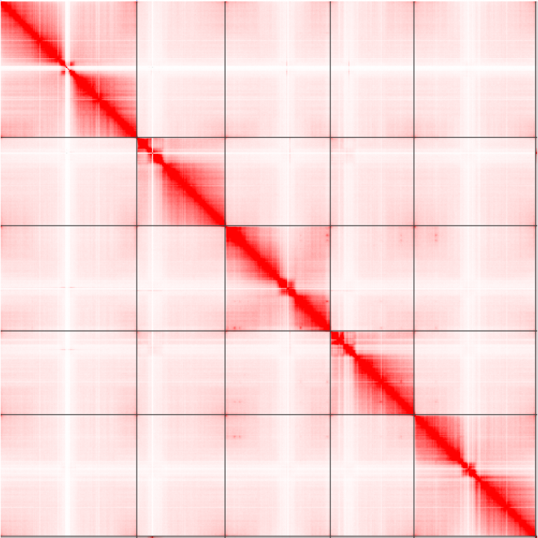

    An example contact matrix from Arabidopsis thaliana. Notice how there are 5
    obvious chromosomes?

There are additional suites of software that interact with these contact matrices
to call **features** in the data, such as long-range chromatin loops, and
short-distance contact domains. Arrowhead can call these contact domains
(TADs) that interact with each other more than expected by chance, and
HICCUPS can call these long-range loops (highlighted in blue squares).

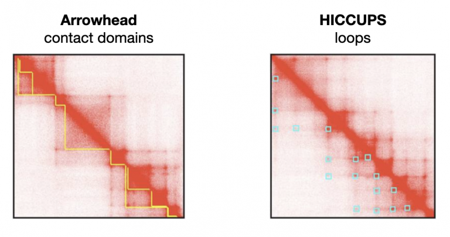

The best way to learn is to dive in. Today we’ll focus on using Juicebox, an
interactive way to work with Hi-C maps and explore them. First, watch this
high-level video from the Juicebox developers:
https://www.youtube.com/watch?v=xA6CLsG_GAs

`Juicebox web <https://www.aidenlab.org/juicebox/>`__ is a cloud-based web app
that allows us to look at and share Hi-C maps with each other. Open up
Juicebox web and poke around a little bit before moving on.

Step 2: Load a Hi-C contact matrix
^^^^^^^^^^^^^^^^^^^^^^^^^^^^^^^^^^

On the Juicebox web app, you should see something like this:

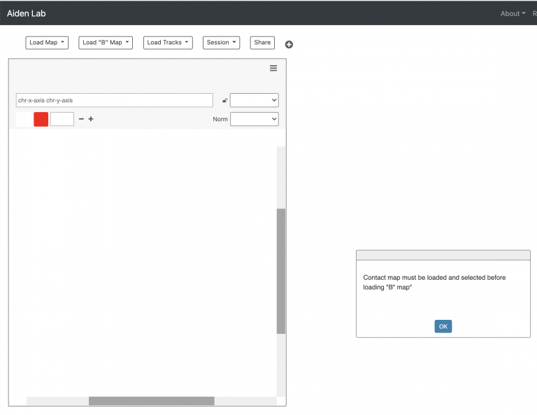

Juicebox web allows you to look at two Hi-C contact matrices at the same time,
which will be nifty for us soon. But for now, go to “Load Map -> Juicebox Archive”.
Juicebox has a lot of hi-c maps from diverse organisms already loaded. Nifty! Is
your organism of choice in there?

For instance, Search for “Arabidopsis”, and you should see two experiments:

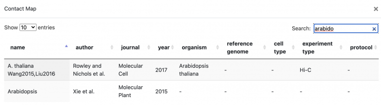

Click the Rowley and Nichols et al. paper, and select “OK” at the bottom right of
the window to load the map. Even without annotations loaded, can you see 5 chromosomes?

Task B
------
Next, let’s follow the video + hands-on tutorial for exploring Human ENCODE Hi-C data. By the end of these 4 tutorial videos, you should know how to 1) explore raw HiC maps, 2) visualize two maps at the same time, 3) Load annotations, 4) share your map.

**Loading maps**

.. raw:: html

    <iframe width="560" height="315"
        src="https://www.youtube.com/embed/e1N0XCtiY3Q"
        title="YouTube video player"
        frameborder="0"
        allow="accelerometer; autoplay; clipboard-write; encrypted-media; gyroscope; picture-in-picture"
        allowfullscreen></iframe>

**Loading Annotations**

.. raw:: html

    <iframe width="560" height="315"
        src="https://www.youtube.com/embed/k4-B1Pz6roI"
        title="YouTube video player"
        frameborder="0"
        allow="accelerometer; autoplay; clipboard-write; encrypted-media; gyroscope; picture-in-picture"
        allowfullscreen></iframe>

**Comparing two maps**

.. raw:: html

    <iframe width="560" height="315"
        src="https://www.youtube.com/embed/WVpMnY0CkfE"
        title="YouTube video player"
        frameborder="0"
        allow="accelerometer; autoplay; clipboard-write; encrypted-media; gyroscope; picture-in-picture"
        allowfullscreen></iframe>

**Sharing maps**

.. raw:: html

    <iframe
        width="560" height="315"
        src="https://www.youtube.com/embed/UT1obhZVRo4"
        title="YouTube video player"
        frameborder="0"
        allow="accelerometer; autoplay; clipboard-write; encrypted-media; gyroscope; picture-in-picture"
        allowfullscreen></iframe>

Mastering Content
-----------------
Now that you know how to use Juicebox.js to explore two maps at the same time,
this is the ideal scenario for us to explore our two haplotype .hic contact
matrices at once. I used SALSA to map our raw Hi-C data to each of the two
haplotypes for scaffolding into chromosomes.

The .hic format data will be available in /scratch ASAP (it is still running!)

Anyone like Tetris? Here’s an example of how someone uses Hi-C maps to fix a
genome, and order/orient contigs into chromosomes —
https://www.youtube.com/watch?v=IMmVp8FodmY

We’ll be doing this with toomers!

Finding mis-assemblies
----------------------
Now comes the hard part: How do we find and correct mis-assemblies in the Hi-C
data to produce our **final haplotype assemblies**.

It turns out that SALSA2 performed poorly on our data. I ran a more intensive,
 but usually more accurate, scaffolding program called Juicer/3D-DNA.

I’ve left the raw results in `/scratch/hic-scaff/`

There are two files per haplotype:

- ``.hic`` map:  ``hifiasm.hic.gfa.hic.hap1.p_ctg.rawchrom.hic``
- ``.assembly`` file describing raw chromosomes: ``hifiasm.hic.gfa.hic.hap1.p_ctg.rawchrom.assembly``

Download these two files per haplotype to your laptop, and load these maps into
Juicebox — the Desktop version.

Load the .hic map for haplotype1 using File->Open. Then load the .assembly file
using Assembly->Import Map Assembly. You should see a contact map that looks
like this:

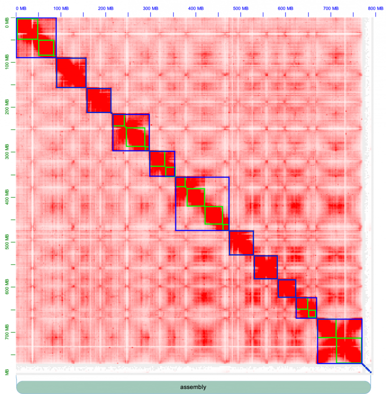

Chromosomes are outlined in blue, contigs outline in green. There are strong
inter-chromosome interactions, or in other words, the chromosomes form strong
square blocks. Fiddle around with the knobs on Juicebox to get acquainted; change
the **normalization** (e.g. I often use “Balanced” normalization), and pull the slider
on “Color Range” all the way to the maximum. The contact map looks pretty excellent,
for the most part: there are strong, within-chromosome interactions, that appear as a
strong diagonal line.

For a quick primer on how to manually edit genomes, watch this Aiden lab video from
Olga, who wrote Juicebox. Afterwards, I’ll walk you through one of these manual
edits to break a chromosome.

.. raw:: html

    <iframe
        width="560" height="315"
        src="https://www.youtube.com/embed/Nj7RhQZHM18"
        title="YouTube video player"
        frameborder="0"
        allow="accelerometer; autoplay; clipboard-write; encrypted-media; gyroscope; picture-in-picture"
        allowfullscreen></iframe>

Juicer thinks there are 11 chromosomes, and that’s not right. Do you see where we
should make the break, and split a chromosome into two? Zoom into the 6th chromosome
by double-clicking it.

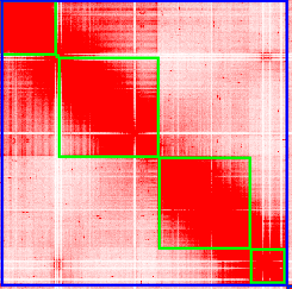

To create a break in the chromosomes, drag your mouse close to the gap and you’ll
see a right angle appear:

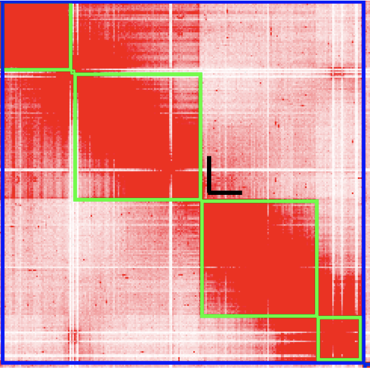

Click your mouse at that right-angle gap, and you’ll see the chromosome split into 2.

Now it’s looking better! We have 12 chromosomes.

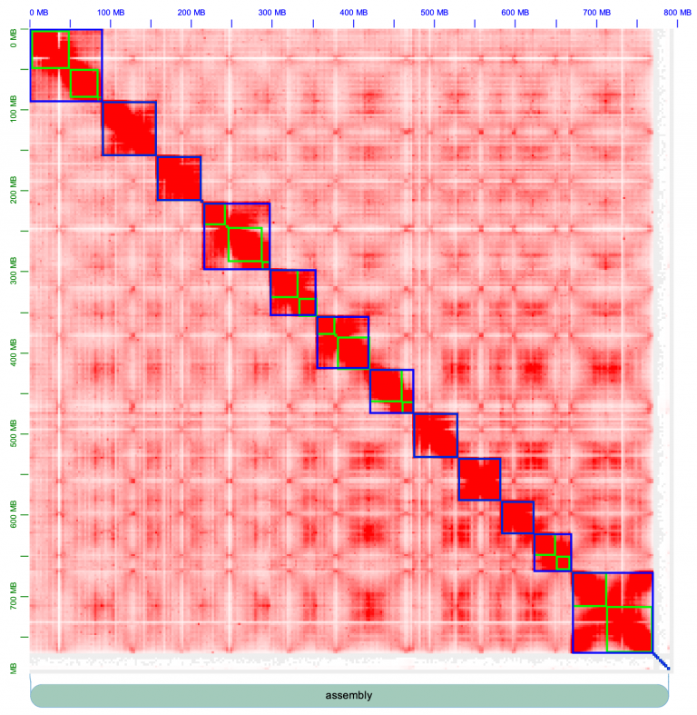

Now we can zoom in fine-scale and look at the contigs more deeply. There’s
always more than meets the eye. Zoom in one chromosome 1. There is a lot of trash
in this contig, at the very beginning of the assembly, in the very top left corner.
Zoom in more!

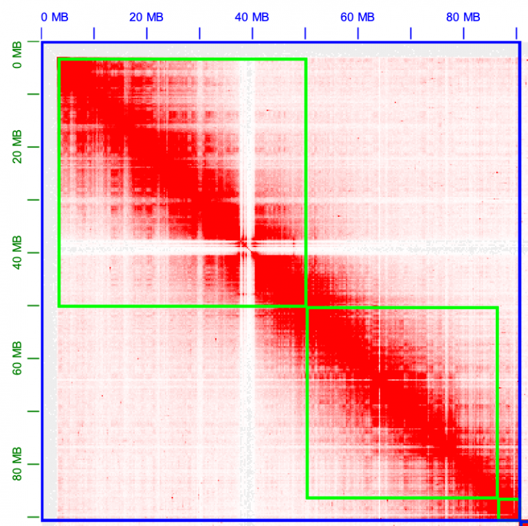

All of these little tiny contigs need to moved to the trash, or “debris” as it’s
called in Juicebox.

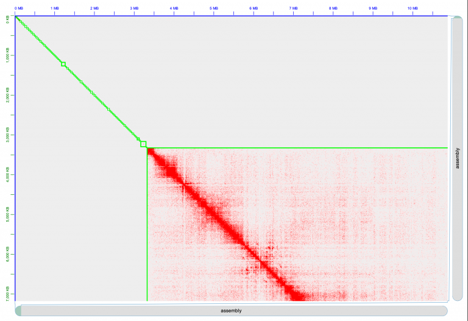

Hold shift and then drag your mouse to include ALL of these tiny little contigs.
They’ll turn black, and be surrounded by a faint yellow box. Right click one of the
boxes, and select “Move to debris”. Voila.

.. image:: media/image-11-768x766.png

And just like that, you’ve made your first chromosome edit! It should look like this now.

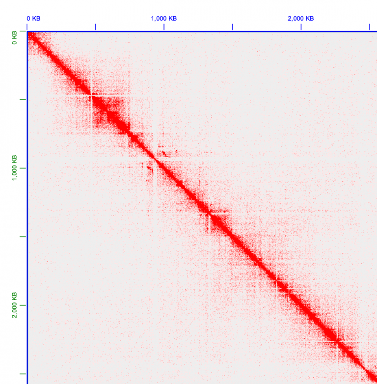

Make your way through every chromosome, and just like Olga does in her instructional
video, find mis-assemblies where the chromosomes look incorrectly placed. Here’s an
example on chromosome 11, that looks very much like Olga’s example in her Youtube
video: Can you fix chromosome 11? That piece at the end looks like it’s in the
wrong place…

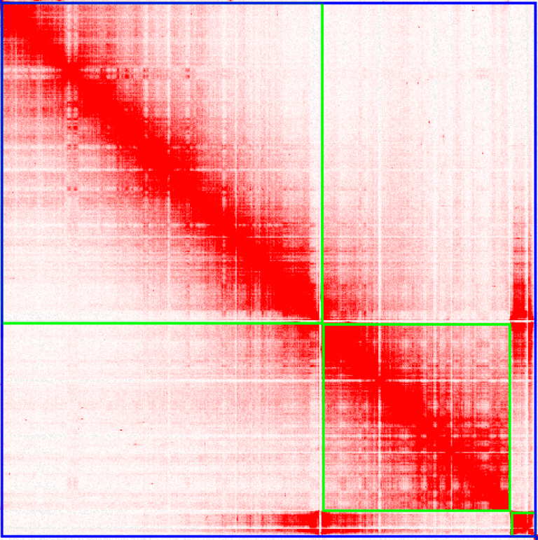

Make your way through every chromosome. Create manual edits where necessary. To
save your edits, use Assembly->Export Assembly.

Before class on Wednesday, create a folder in our shared google drive
and leave your edits for both haplotypes in the drive.
