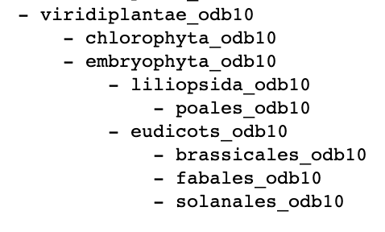
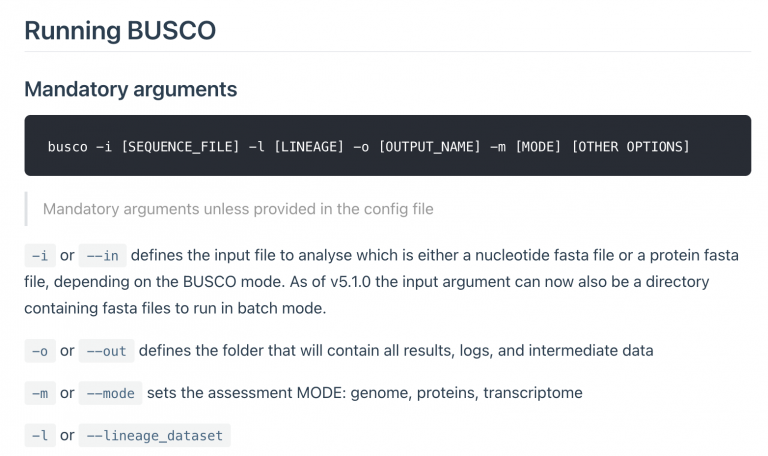
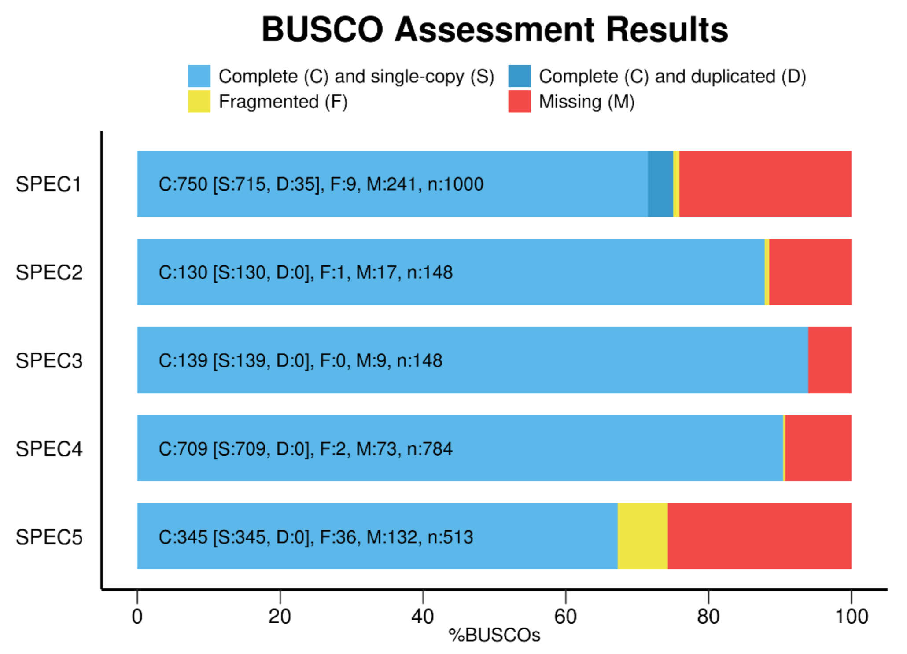

Lab Exercises
=============
In this lab, we will learn the basics of assessing the completeness of a draft assembly.

We will do two major things in this lab:

- Run assemblytics to compare haplotype1 and haplotype2 of our phased assembly, to
  identify any major issues
- Run BUSCO to identify core, conserved genes in the assembly, and objectively
  assess its quality

    `"Be for real, don't be a stranger"` - Spice Girls

Task A
------
There are several ways that we can objectively measure the quality of our genome assembly. One of these methods is by searching for super-conserved, core eukaryotic genes. There are genes that exist in nearly all plant genomes that have very conserved functions, sometimes called “housekeeping genes”, that tend to 1) evolve slowly, 2) maintain their gene structure over time, 3) be present in low or single copy.

`BUSCO <https://busco.ezlab.org/>`_ is a software tool that has built databases of
these conserved, core eukaryotic genes for different lineages on the tree of life.
For plants, a variety of databases exist, including e.g. all Viridiplantae, or
focusing more finely in one some lineages, e.g. Solanaceae family (potato, tomato).

.. figure:: media/busco_sampling.png
    :alt: BUSCO sampling space

    Image Source: `BUSCO Website <https://busco.ezlab.org/home/busco_sampling.png>`__

Just like the manual tells us, install BUSCO with Conda

.. code-block:: bash

    conda install -c conda-forge -c bioconda busco=5.2.2

However, the install will fail, and tell you that BUSCO needs python3. Oops. It
even tells us this in the manual!

Third-party components
^^^^^^^^^^^^^^^^^^^^^^
A full installation of BUSCO requires Python 3.3+ (2.7 is not supported from v4
onwards), BioPython, pandas, tBLASTn 2.2+, Augustus 3.2, Prodigal, Metaeuk,
HMMER3.1+, SEPP, and R + ggplot2 for the plotting companion script. Some of
these tools are necessary only for analysing certain type of organisms and
input data, or for specific run modes.

Luckily you’ve already made a conda environment that runs python3. Activate it:

.. code-block:: bash

    conda activate py3.7

Then reinstall.

Next, follow the BUSCO user guide. First, explore the possible databases.

.. code-block:: bash

    busco --list-datasets

Most of these databases are not useful to you. There are just a handful of plant
databases:

We’ll just use “eudicots_odb10”.

Then check out the BUSCO options, using the -h flag

::

  -i FASTA FILE, --in FASTA FILE
                        Input sequence file in FASTA format. Can be an assembled genome or transcriptome (DNA), or protein sequences from an annotated gene set.
  -o OUTPUT, --out OUTPUT
                        Give your analysis run a recognisable short name. Output folders and files will be labelled with this name. WARNING: do not provide a path
  -m MODE, --mode MODE  Specify which BUSCO analysis mode to run.
                        There are three valid modes:
                        - geno or genome, for genome assemblies (DNA)
                        - tran or transcriptome, for transcriptome assemblies (DNA)
                        - prot or proteins, for annotated gene sets (protein)
  -l LINEAGE, --lineage_dataset LINEAGE
                        Specify the name of the BUSCO lineage to be used.
  --auto-lineage        Run auto-lineage to find optimum lineage path
  --auto-lineage-prok   Run auto-lineage just on non-eukaryote trees to find optimum lineage path
  --auto-lineage-euk    Run auto-placement just on eukaryote tree to find optimum lineage path
  -c N, --cpu N         Specify the number (N=integer) of threads/cores to use.
  -f, --force           Force rewriting of existing files. Must be used when output files with the provided name already exist.
  -r, --restart         Continue a run that had already partially completed.
  -q, --quiet           Disable the info logs, displays only errors
  --out_path OUTPUT_PATH
                        Optional location for results folder, excluding results folder name. Default is current working directory.
  --download_path DOWNLOAD_PATH
                        Specify local filepath for storing BUSCO dataset downloads
  --datasets_version DATASETS_VERSION
                        Specify the version of BUSCO datasets, e.g. odb10
  --download_base_url DOWNLOAD_BASE_URL
                        Set the url to the remote BUSCO dataset location
  --update-data         Download and replace with last versions all lineages datasets and files necessary to their automated selection
  --offline             To indicate that BUSCO cannot attempt to download files
  --metaeuk_parameters METAEUK_PARAMETERS
                        Pass additional arguments to Metaeuk for the first run. All arguments should be contained within a single pair of quotation marks, separated by commas. E.g. "--param1=1,--param2=2"
  --metaeuk_rerun_parameters METAEUK_RERUN_PARAMETERS
                        Pass additional arguments to Metaeuk for the second run. All arguments should be contained within a single pair of quotation marks, separated by commas. E.g. "--param1=1,--param2=2"
  -e N, --evalue N      E-value cutoff for BLAST searches. Allowed formats, 0.001 or 1e-03 (Default: 1e-03)
  --limit REGION_LIMIT  How many candidate regions (contig or transcript) to consider per BUSCO (default: 3)
  --augustus            Use augustus gene predictor for eukaryote runs
  --augustus_parameters AUGUSTUS_PARAMETERS
                        Pass additional arguments to Augustus. All arguments should be contained within a single pair of quotation marks, separated by commas. E.g. "--param1=1,--param2=2"
  --augustus_species AUGUSTUS_SPECIES
                        Specify a species for Augustus training.
  --long                Optimization Augustus self-training mode (Default: Off); adds considerably to the run time, but can improve results for some non-model organisms
  --config CONFIG_FILE  Provide a config file
  -v, --version         Show this version and exit
  -h, --help            Show this help message and exit
  --list-datasets       Print the list of available BUSCO datasets

The minimum requirements to run BUSCO are

Launch a BUSCO run using…

- ``-i`` genome.fasta
- ``-m`` genome
- ``-o`` haplotype1_busco (or haplotype2_busco)
- ``-l`` eudicots_odb10
- ``-c`` 4

Task B
------
Run Assemblytics to compare both haplotypes
^^^^^^^^^^^^^^^^^^^^^^^^^^^^^^^^^^^^^^^^^^^

Now that we have two phased assemblies, one for each haplotype, we should do some
sanity checks. Remember: once you move on from this phase of a genome project, it
is hard to “go back” and fix issues with the genome assembly.

You’ve run `assemblytics <http://assemblytics.com/>`__ before, so you should be
familiar. This will take ~6 hours. Focus in particular on the synteny dotplot
that is produced. We’ll want to make sure our two haplotypes are largely contiguous
with each other.

Note: just because a genome is highly heterozygous doesn’t mean that the two
haplotypes will be structurally similar. That is, there can certainly be large-scale
structural rearrangements and variants that occur.

Mastering Content
-----------------

After your BUSCO run has finished, use the “generate_plot.by” script from the user
guide to construct a barplot of both haplotypes that shows the number of Complete,
Fragmented, Missing genes, like this:

    Image Source `Busco Website <https://busco.ezlab.org/home/busco_plot.png>`__
