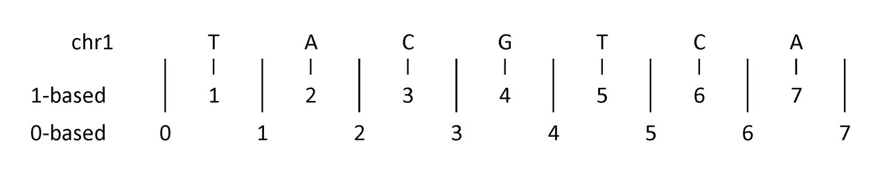

4.1 Lab Exercises
=================
Overview
--------
In this lab, we will learn the basics of performing genome arithmetic, and operating on intervals.

We will do two major things in this lab:

- Work through an interactive bedtools tutorial from the Quinlan lab (who developed it)
- Walk through some examples of different file formats that bedtools can operate on
- Run Liftoff2 to lift-over gene annotations from the Q. rubra genome onto ours

    `"Be for real, don't be a stranger"` - Spice Girls

Task A
------
At the end of the day, a fasta file with our genome assembly is just a string of ATCG’s. We have
to layer annotations on top of that fasta file. These can be gene annotations (in .gff or .gtf format),
repetitive element annotations (in .gff format), RNA-seq alignments (in .bam format), RNA-seq
expression counts (in .bed format), and more.

These annotation formats all have one thing in common: they are based on intervals of genomic
coordinates that have starts and stops. For instance, GeneA is on chromosome 4 at basepair
location 21244 to 23299.

How can we start to interact with those annotations? Typically, you will need to overlap intervals
of interest with other features of the genome, again represented as intervals. For example, you may
want to overlap transcription factor binding sites with CpG islands or promoters to quantify
what percentage of binding sites overlap with your regions of interest. Overlapping mapped reads
from high-throughput sequencing experiments with genomic features such as exons, promoters, and
enhancers can also be classified as operations on genomic intervals. You can think of a million
other ways that involve overlapping two sets of different features on the genome. For example,

- “What gene overlaps with this QTL peak?”
- “I need the 1 kb in the 5′ upstream region of these 20 genes”
- “Which genes are within 500 nt of an LTR retrotransposon?”

All of these questions can be answered with bedtools, perhaps the most useful set of tools to
answer questions regarding genome arithmetic.

.. figure:: ./media/bedtools-intersect-glyph.png
    :alt: BedTools intersect glpyh

    Image source: BedTools documentation

How bedtools intersect works with one or more files.

Work through this `interactive Bedtools tutorial <https://sandbox.bio/tutorials/?id=bedtools-intro&step=1>`_, based on the Quinlan lab (who wrote bedtools).

Task B
------
Explore data formats
~~~~~~~~~~~~~~~~~~~~

Bedtools can operate on a number of different formats of files., e.g. vcf, bam, bed, fasta, at
the same time. Having some knowledge of these formats is necessary.

**Format 1**: BED (Browser Extensible Data) format provides a flexible way to define the data lines
that are displayed in an annotation track. BED lines have three required fields and nine additional
optional fields. The number of fields per line must be consistent throughout any single set of data
in an annotation track. The order of the optional fields is binding: lower-numbered fields must
always be populated if higher-numbered fields are used.

The first three required BED fields are:

- **chrom** – The name of the chromosome (e.g. chr3, chrY, chr2_random) or scaffold (e.g. scaffold10671).
- **chromStart** – The starting position of the feature in the chromosome or scaffold. The first base in a
  chromosome is numbered 0.
- **chromEnd** – The ending position of the feature in the chromosome or scaffold. The chromEnd base is
  not included in the display of the feature, however, the number in `position format <https://genome.ucsc.edu/FAQ/FAQtracks#tracks1>`_ will be
  represented. For example, the first 100 bases of chromosome 1 are defined as chrom=1,
  chromStart=0, chromEnd=100, and span the bases numbered 0-99 in our software (not 0-100),
  but will represent the position notation chr1:1-100. Read more `here <http://genome.ucsc.edu/blog/the-ucsc-genome-browser-coordinate-counting-systems/>`_.
  chromStart and chromEnd can be identical, creating a feature of length 0, commonly used for
  insertions. For example, use chromStart=0, chromEnd=0 to represent an insertion before the
  first nucleotide of a chromosome.

After these 3 mandatory columns, you can append all kinds of additional information to these
locations. You can add gene names, strand (+ or -), gene counts (expression), and so on.

**Format 2**: GFF (General Feature Format) consists of one line per feature, each containing 9 columns of
data, plus optional track definition lines.

Fields **must** be tab-separated. Also, all but the final field in each feature line must contain a
value; “empty” columns should be denoted with a ‘.’

- **seqname** – name of the chromosome or scaffold; chromosome names can be given with or without
  the ‘chr’ prefix. Important note: the seqname must be one used within Ensembl, i.e. a standard
  chromosome name or an Ensembl identifier such as a scaffold ID, without any additional content
  such as species or assembly. See the example GFF output below.
- **source** – name of the program that generated this feature, or the data source (database or project name)
- **feature** – feature type name, e.g. Gene, Variation, Similarity
- **start** – Start position* of the feature, with sequence numbering starting at 1.
- **end** – End position* of the feature, with sequence numbering starting at 1.
- **score** – A floating point value.
- **strand** – defined as + (forward) or – (reverse).
- **frame** – One of ‘0’, ‘1’ or ‘2’. ‘0’ indicates that the first base of the feature is
   the first base of a codon, ‘1’ that the second base is the first base of a codon, and so on.
- **attribute** – A semicolon-separated list of tag-value pairs, providing additional
  information about each feature.

.. figure:: ./media/gff-screenshot.png
    :alt: GFF3 Format – NGS Analysis

    Image source: `Next-Generation Sequencing Analysis Resources <https://learn.gencore.bio.nyu.edu/>`_

**What to look out for**: 0-based vs 1-based coordinates

Do we start at 0, or start at 1?

The example above shows (an imaginary) first seven nucleotides of sequence on chromosome 1:

- 1-based coordinate system
  - Numbers nucleotides directly
- 0-based coordinate system
  - Numbers between nucleotides

    Image source:

**0-based**: BED, BAM, BCF

**1-based**: GTF, GFF, SAM, VCF, BLAST, GenBank/EMBL

Bedtools recognizes these differences and inter-converts for you.
