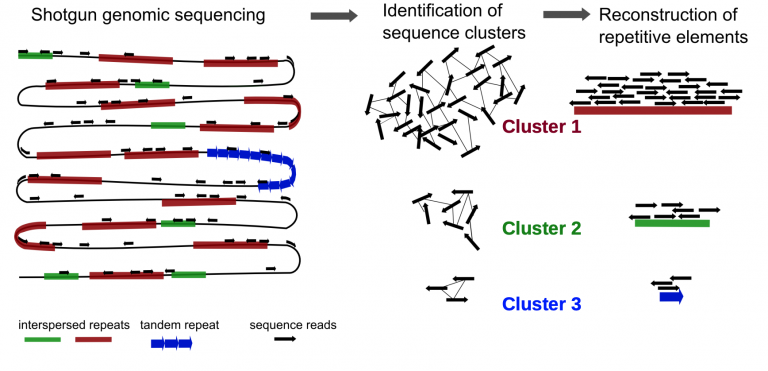

4.2 Lab Exercises
=================
Overview
--------

This is a longer lab that takes us away from the command line.

We will do two major things in this lab:

- Learn how to use the Repeatexplorer2 portal on Galaxy
- Walk through the RepeatExplorer2 Nature Protocols paper and subsample shotgun data
  from Toomers Oak
- Upload data to Galaxy
- Run RepeatExplorer2 to characterize TE content in Toomers Oak

Task A
------
We can use Illumina paired-end shotgun genome data to predict how repetitive a
genome is. Plant genomes are filled with repetitive DNA — but do we need to sequence
an entire plant genome to figure out what percent of a genome is filled with repeats?

No. Imagine you have a 3 billion piece puzzle. Even if you only take 10,000 random
pieces of that puzzle, you can roughly see what the puzzle *should* be. That premise
underlies how RepeatExplorer2 works. Even with a small subsample, 1% coverage of the
genome, you can nicely estimate the repetitive content of a plant genome. In short,
it works by taking a small sample of reads from your genome of interest, clustering
them together, and trying to reconstruct consensus sequences of repetitive elements.
By doing this, you can estimate what total % of a genome is repetitive, and break
down individual superfamilies of transposable elements.

Here is the main RepeatExplorer2 site to start from: https://galaxy-elixir.cerit-sc.cz/

First, Register (don’t re-use any known username or password of yours!) :
https://perun.cesnet.cz/elixir2/registrar/?vo=elixir-cz&group=repeatExplorer

Then you’ll have access to the Galaxy server:
https://repeatexplorer-elixir.cerit-sc.cz/galaxy/

Second, follow along with the Nature Protocols paper describing how to run
RepeatExplorer2. You’ll be using the Toomers Oak PE150 PCR-free shotgun data,
though. I’ve also left this pdf in the class resources for this module.

https://www.nature.com/articles/s41596-020-0400-y.epdf
